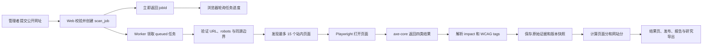

# AccessCheck Lishui 一次性完整实施计划（AI 执行版）

> 本文件是完整施工说明书，不是建议清单。执行 AI 必须按顺序实现全部内容，并以测试和验收结果判断完成，不得留下未完成标记、假数据、空页面或未接通的按钮。

## 本计划与原 Word 的关系

- `AccessCheck_Lishui_项目方案_定稿版.docx` 只用于理解项目目的、研究范围和希望留下的成果，不是严格需求规格书。
- 本 Markdown 是项目唯一执行标准。两者出现冲突时，以本 Markdown 中更安全、可复现、可测试的方案为准。
- 原 Word 的六周日程不进入执行要求；编码 AI 连续完成全部可自动完成的工作。
- 项目核心目的保持不变：用自动化工具检查公开数字服务网站，把可自动判断的问题转化为透明、可解释的研究指标，并形成系统、数据、分析和真实成果材料。

把本文件交给编码 AI 时，可同时发送这句开场指令：

```text
请先完整阅读《AccessCheck Lishui 一次性完整实施计划（AI 执行版）》，然后直接在当前仓库中按“执行步骤”从头实现。不要只输出示例或重新写计划；每完成一步都运行规定测试并更新 IMPLEMENTATION_STATUS.md。未通过自动化质量门时不要进入下一步。遇到必须由真人或外部单位提供的输入时，先完成所有不依赖它的代码、测试、模板和脚手架，把唯一阻塞清单写入 EXTERNAL_INPUTS.md，状态标为 WAITING_EXTERNAL_INPUT；收到真实输入后用 `pnpm project:resume` 幂等续跑。不得伪造输入来换取“完成”。
```

## 给两位项目负责人的 1 分钟说明

这份计划执行完后，你们拿到的不是一个代码示例，而是一套能登录、输入网址、自动扫描、保存证据、计算总分/四项分、发布结果、导出数据、生成研究分析和两份正式报告的完整项目。代码、测试、数据库、网页、报告生成器、数据分析和学习资料都要求 AI 做完并自测。

你们后面主要做四件真人必须做的事：确认正式研究网站；分别判断系统抽出的真实问题；核对结论并真正理解各自部分；需要时提供服务器/GitHub/残联接收信息。计划用固定文件、hash、参考答案和操作练习把这些事情理顺，不要求你们重新手写系统。

本轮明确不制作 PPT、讲稿或现场发言内容。等项目和研究结果真实完成、两人都能解释清楚后，再另做展示材料。

## 0. 执行 AI 必须遵守的规则

1. 先完整阅读本文件，再开始创建代码。
2. 只实现一个最终版本，不划分缩减版、试用版或未来增强版。
3. 执行步骤有先后依赖，但每一项都属于最终交付范围。
4. 不自行改变本文件锁定的项目边界、评分公式、数据库字段或安全规则。
5. 每完成一个步骤，必须运行该步骤规定的检查；检查失败不得进入下一步。
6. 不伪造扫描结果、研究数据、人工验证记录或测试通过记录。
7. 不为了让测试通过而删除测试、降低断言或吞掉异常。
8. 所有依赖使用相互兼容的稳定版本，提交 lockfile，并在 README 记录 Node、pnpm、Python、Playwright、axe-core 的实际版本。
9. 所有会影响研究结果的配置必须保存快照，不能只存在于当前环境变量中。
10. 技术性小决定由执行 AI 根据本计划直接完成；只有域名、服务器/DNS、真正的密钥、GitHub 目标仓库/授权和真实人员/单位信息需要用户提供。
11. 每一步完成后更新根目录 `IMPLEMENTATION_STATUS.md`，记录完成项、测试命令、测试结果和剩余步骤。
12. 最终交付前从空数据库和干净安装环境完整验证一次。
13. 唯一允许保留的待填内容是必须来自真人或外部单位的姓名、日期、单位、签字、盖章、域名/服务器/GitHub 授权；必须用明显占位符和人工行动清单标出，不能伪造。
14. 自动化质量门与真人确认门分开记录。AI 可以连续完成步骤 1–17、步骤 18/19 的生成器和 fixture 验证；正式样本确认、两人独立审核、本人复核和外部签收只能等待真人完成。
15. `EXTERNAL_INPUTS.md` 只记录所需项目、示例格式、当前状态和恢复命令，不保存口令/密钥。所有非阻塞工作做完后才允许以 `WAITING_EXTERNAL_INPUT` 停止；恢复时先校验已完成产物/hash，再从固定检查点继续，不能重做或覆盖正式数据。

## 1. 已锁定的最终效果

### 1.1 使用者看到的完整流程

1. 管理者登录系统。
2. 在中文输入页填写一个公开网站首页地址，并选择本次最多扫描 1–15 页。
3. 系统立即创建扫描任务并显示任务编号。
4. 后台程序自动寻找同一网站内的公开 HTML 页面。
5. 系统逐页打开网站，调用 axe-core 检查自动可判断的无障碍问题。
6. 进度页实时显示：已发现、正在扫描、成功、失败和剩余页面数量。
7. 扫描结束后显示：

   - 0–100 自动无障碍总分；
   - 可感知、可操作、易理解、兼容性四项分数；
   - Critical、Serious、Moderate、Minor 问题数量；
   - 自动通过、自动失败、需要人工检查、不适用的规则数量；
   - 每个问题所在页面、网页元素、原因、WCAG 条款和修改建议；
   - 扫描失败页面和失败原因；
   - scanner、axe-core、规则映射和评分模型版本。

8. 管理者检查结果后，可以把该次扫描发布到公开研究总览。
9. 公开访客不需要登录，可以查看已发布网站的结果、比较图表和报告，但不能匿名启动扫描任务。
10. 管理者可以导出：

    - 单个网站 HTML 报告；
    - 单个网站 PDF 报告；
    - 研究用 CSV；
    - 完整机器可读 JSON；
    - 导出清单 `manifest.json`。

11. Python/Jupyter 可以只读取导出文件，重建统计表、分布图、常见问题图和敏感性分析结果。

### 1.2 最终交付物

- 可运行的中文 Web 系统；
- 独立后台扫描 Worker；
- SQLite 数据库和全部迁移；
- Playwright + axe-core 扫描器；
- 固定、透明、可复现的评分模块；
- 四个研究维度和总分；
- 问题详情、研究总览、发布与报告功能；
- HTML、PDF、CSV、JSON 导出；
- Python/Jupyter 统计与敏感性分析；
- 已知问题测试网站；
- 单元、集成、API、端到端和数据一致性测试；
- Docker Compose 部署；
- README、数据字典、模型说明、验证日志和操作手册；
- 10–20 个正式研究网站、每站约 10–15 页、合计 100–300 个成功页面的数据能力。
- 完整学术型研究报告，包含研究问题、方法、结果、验证、敏感性分析、局限和结论；
- 面向丽水市残联或相关单位的《丽水市公共数字服务信息无障碍自动评估报告》；
- 可打印的报告封面、成果接收页和《项目实践与成果接收证明》草稿；
- 计算机负责人和数学/数据负责人各自的学习说明、理解检查、常见问答与贡献证据索引；
- GitHub 仓库整理、发布标签、版本说明和最终成果清单；
- 一份“两人接手包”，让两位负责人可以按文件顺序理解、演示、解释和维护项目。

### 1.3 永久边界

- 只扫描公开页面，不登录、不绕验证码、不访问需要权限的内容。
- 不把结果称为官方认证、WCAG 合规率或完整人工审计。
- 不训练 AI 模型，不做聊天机器人，不做手机 App。
- 不采集用户 Cookie、密码、表单值或完整网页正文。
- 不保存完整 HTML；只保存经过清理且长度受限的问题元素片段。
- 不自动向被扫描网站提交表单、点击业务按钮或改变对方数据。
- 不允许公开匿名访客任意消耗扫描资源。
- 不用 Redis、消息队列、业务微服务或分布式数据库；Caddy 和只做 SSRF 防护的 egress proxy 属于安全基础设施，不承载业务数据。

### 1.4 必须出现的免责声明

输入页、结果页、公开研究页、HTML 报告和 PDF 报告都必须显示：

> 本项目仅评价 axe-core 能够自动判断的网页无障碍检查项。分数不等同于完整人工审计、官方 WCAG 合规认证或“符合 WCAG 的百分比”。需要人工判断的项目会单独列出。

## 2. 锁定的运行方式

### 2.1 部署方式

- 使用一个代码仓库。
- 使用 Docker Compose 启动 `web` 和 `worker` 两个应用进程，并启动只负责网络安全的 `egress-proxy` sidecar；生产公开访问再由 Caddy 反向代理。
- 两个进程共享一个持久化 SQLite 数据目录和报告目录。
- 本地开发也分别运行 Web 和 Worker，行为与 Docker 一致。
- 公开页面只读取已发布结果。
- 创建扫描、重新扫描、发布和取消必须经过管理会话；独立人工审核、裁决批准和真人门证据必须经过对应负责人的 role-bound reviewer 会话。

### 2.2 管理登录

- 不建立多人账号系统。
- 使用环境变量 `SCAN_ADMIN_TOKEN` 保存扫描/发布管理口令；另用两个互不相同且由两位负责人分别持有的 `COMPUTER_REVIEW_TOKEN`、`MATH_REVIEW_TOKEN` 绑定 `computer_lead`、`math_lead`。三枚 token 均不得使用示例默认值。
- `/admin/login` 接收口令，成功后设置签名、`HttpOnly`、`SameSite=Strict` 的会话 Cookie。
- `/review/login` 接收 reviewer token，服务端只从匹配的 token 派生固定 role 并签发独立 `HttpOnly` reviewer Cookie/CSRF token；reviewer role **绝不接受 query、body、隐藏表单或前端状态自报**。两人使用不同浏览器 profile/设备，不能共享 reviewer Cookie。
- Cookie 由 `SESSION_SECRET` 签名，设置明确过期时间。
- 服务端使用恒定时间比较口令。
- 前端不得把管理口令写入 URL、日志、数据库或浏览器本地存储。
- API 必须在服务端再次检查会话，不能只隐藏按钮。admin 会话只能看 batch 进度计数，在双方提交前不能看具体 verdict，且不能代表 reviewer 提交审核、批准裁决或通过 R1–R5；审核记录的 reviewer 一律取服务端会话 role。
- reviewer token 只能由本人作为外部输入设置，AI 只能生成无值的 `.env.example` 和登录说明，不得替两人生成“确认已完成”的会话证据。

### 2.3 本地运行与公开部署的完成标准

本轮必须同时交付两种可验证形态：

1. **本地完整运行**：执行 `docker compose up` 后，Web、Worker、SQLite、报告目录和健康检查全部可用，不依赖域名。
2. **公开部署模板**：提供 `compose.prod.yaml`、`Caddyfile`、生产环境变量说明、备份/恢复命令和上线检查表。真实服务器、域名、DNS 和密钥由用户提供后才能完成真实上线，执行 AI 不得虚构这些外部输入。

生产部署锁定以下规则：

- 只有 Caddy 对外开放 80/443；SQLite 不开放网络端口。Worker 不加入 Web/Caddy 网络，只加入 `scan-isolated` 内部网络并仅能连接 `egress-proxy`；`egress-proxy` 单独连接外网且不能挂载数据库/报告卷。
- HTTPS 下会话 Cookie 必须额外设置 `Secure`；所有改变状态的管理请求同时校验登录会话、CSRF token 和同源 `Origin`。
- 管理/reviewer 登录和创建扫描接口按来源地址限速；只有来自受信反向代理的转发地址头才可用于限速。
- 设置严格 CSP、`X-Content-Type-Options: nosniff`、`Referrer-Policy`、frame 限制和其他适用安全头；确认 HTTPS 正常后再启用 HSTS。
- 生产环境不返回内部堆栈；日志自动轮转，不记录密钥、Cookie、完整 HTML 或表单值。
- SQLite、WAL、报告和导出放在明确的持久卷；提供一致性备份、恢复到临时卷并运行 `db:check` 的演练。
- 真人门 receipt、outbox 文件和 R4 candidate 使用独立的私有持久根 `PRIVATE_EVIDENCE_ROOT`。本地默认解析为已 gitignore 的仓库外/工作区 `private-inputs/`；Compose 必须把宿主机绝对目录或专用加密卷挂载到 Web 容器 `/var/lib/accesscheck/private-evidence`，且只有 Web 内的 outbox writer 和受控 deliverables/gates 一次性命令可读写。Worker、Caddy、egress-proxy、文档渲染器和公开静态目录绝不挂载它；目录权限生产为 0700、文件 0600，应用 UID 固定且不共享。缺失/可公开访问/不可写的根目录使生产 Web 拒绝启动。
- 私有证据不进入普通公开备份。提供单独加密备份/恢复命令，恢复到新的私有临时根后必须运行 `gates:verify`，核对 DB evidence/outbox、receipt/candidate 字节和 R4/full bundle hash；不得把密钥或备份绝对路径写进 Git/公开日志。
- `SCAN_ADMIN_TOKEN`、两枚 reviewer token、`SESSION_SECRET`、域名和允许的外部 Origin 只从生产密钥配置读取，不能写进镜像、仓库或前端包。
- `APP_GIT_COMMIT` 是 `pnpm release:image` 从 passed validation attestation 所绑定的 `finalCandidate` 解析并写入 server-only `build-provenance.json` 的完整 commit SHA，不是管理员可在运行时随意填写的普通环境变量；同一值另写入 OCI label。容器内应用只读取随镜像构建的 provenance，不挂载 Docker socket、也不声称能在容器内读取自身 OCI label；发行脚本在容器外用镜像检查工具逐项比较 candidate、内嵌 provenance 和 OCI label 后才生成 build attestation。生产镜像按该 attestation 中的 digest 部署。开发服务器或缺少 attestation 的普通镜像默认禁止公开 study ZIP。
- Worker 按 Playwright 对“不可信网站爬取”的建议使用非 root 用户、启用 Chromium sandbox 和固定 seccomp profile，并设置 `no-new-privileges`、drop capabilities、只读根文件系统、受限 `/tmp`、内存/CPU/PID/执行时长上限；不得用 root + `--no-sandbox` 扫描真实网站。

## 3. 固定技术架构

| 部分 | 采用方案 |
| --- | --- |
| 主语言 | TypeScript，严格模式 |
| Web | Next.js App Router，Node.js runtime |
| UI | React + 简洁中文组件 + Recharts |
| 输入校验 | Zod |
| 浏览器自动化 | Playwright Chromium |
| 无障碍扫描 | axe-core |
| 数据库 | SQLite + Drizzle ORM + better-sqlite3 |
| 后台任务 | 独立 TypeScript Worker 轮询 SQLite |
| 出站安全 | 基于固定 Stripe Smokescreen/goproxy commit 的双模式 egress proxy sidecar，同时处理普通 HTTP forward proxy 与 HTTPS/WSS CONNECT；Worker 容器无直接公网路由 |
| 日志 | Pino 结构化日志 |
| 单元/集成测试 | Vitest |
| 浏览器端到端测试 | Playwright Test |
| 报告 | 服务端 HTML + Playwright PDF |
| 最终成果文档 | 同一结构化数据生成 Markdown、DOCX 和 HTML/PDF；DOCX 用 Node `docx`，视觉核验用固定版本 LibreOffice/Poppler 容器 |
| 研究导出 | CSV + JSON + manifest |
| 数学分析 | Python、pandas、NumPy、SciPy、Jupyter、Matplotlib/Seaborn |
| 包管理 | pnpm |
| 部署 | Dockerfile + Docker Compose |

### 3.1 锁定依赖基线

本计划的起始基线按 2026-08-19 的稳定版本锁定；不使用 beta、RC、canary 或 `latest` 浮动标签：

| 组件 | 固定版本/要求 |
| --- | --- |
| Node.js | `24.19.0` LTS |
| pnpm | `11.20.0`，写入 `packageManager` |
| Next.js | `16.3.0`；`create-next-app`、`@next/env`、`@next/swc-*` 等 Next 配套包必须解析为同一 `16.3.0` 发布线，不得混入 `16.3.1-canary.*` |
| React / React DOM / react-is | `19.2.8` |
| Playwright / `@playwright/test` | `1.62.0` |
| Playwright 镜像 | `mcr.microsoft.com/playwright:v1.62.0-noble`，首次验证后再记录 OCI digest；包与镜像版本必须完全一致 |
| axe-core | `4.13.0` |
| Drizzle ORM | `0.45.2`，不使用 1.0 RC |
| better-sqlite3 | `13.0.3` |
| Zod | `4.4.3` |
| Vitest | `4.1.10` |
| Recharts | `3.10.1` |
| Pino | `10.3.1` |
| Node docx | `9.7.1` |
| Python | `3.12.13`（本地或固定容器） |
| pandas / NumPy / SciPy | `3.0.5 / 2.5.1 / 1.18.0` |
| LibreOffice / Poppler / Noto CJK | 在 `tools/document-renderer` 构建时记录精确包版本、基础镜像 digest 和最终镜像 digest |
| Stripe Smokescreen | 步骤 1 从官方仓库选取已包含公开 SSRF 修复的固定 commit，记录 commit、源码 hash 和最终镜像 digest；不得跟随 main 浮动 |

所有直接依赖使用 `--save-exact`，Python lock 带 hash，Docker 基础镜像在验证后锁 digest。`docs/dependency-baseline.md` 保存 OS/架构、`node --version`、pnpm 版本、`pnpm list`、Playwright 浏览器版本、`pip freeze`、LibreOffice/Poppler/字体版本、Smokescreen commit 和全部镜像 digest。

步骤 1 首先只创建并运行独立的 `scripts/verify-dependency-baseline.mjs`，在它通过前不创建 Next scaffold、不安装项目依赖：逐项查询 npm/PyPI 的精确版本元数据，确认版本存在、不是 prerelease/deprecated；确认 Node、Playwright、文档渲染器和代理基础镜像 tag/digest 可解析；确认 `create-next-app@16.3.0` 及其 Next 配套包与本表一致。任一精确版本不存在、只有 canary/RC、平台二进制缺失或镜像不可拉取时必须立即停止，不能擅自改用 `latest`；按下一段决策流程更新计划副本后，重新从空目录验证。该预检自身有 fixture 测试，至少证明“不存在版本”和“prerelease 冒充稳定版”会失败。

如果执行时某个精确版本因安全漏洞或平台不可用必须调整，先在 `docs/decisions/` 写兼容性/安全决策，再更新本表的仓库副本、lockfile、镜像 digest 和实际版本快照，并从空环境重跑全部黄金测试；不得只升级 axe 或评分相关依赖后继续混用旧正式数据。正式研究扫描开始后冻结依赖，任何行为变化都生成新 scanner/axe/catalog 版本和新 run。

## 4. 系统工作流



## 5. 目标目录结构

```text
AccessMetrics/
├─ src/
│  ├─ app/
│  │  ├─ page.tsx
│  │  ├─ admin/login/page.tsx
│  │  ├─ admin/scans/new/page.tsx
│  │  ├─ admin/scans/[jobId]/page.tsx
│  │  ├─ admin/reviews/[batchId]/page.tsx
│  │  ├─ scans/[runId]/page.tsx
│  │  ├─ scans/[runId]/issues/page.tsx
│  │  ├─ research/page.tsx
│  │  ├─ reports/[runId]/page.tsx
│  │  └─ api/
│  ├─ server/
│  │  ├─ auth/
│  │  ├─ config/
│  │  ├─ db/
│  │  ├─ jobs/
│  │  ├─ crawler/
│  │  ├─ scanner/
│  │  ├─ wcag/
│  │  ├─ scoring/
│  │  ├─ reports/
│  │  ├─ exports/
│  │  └─ logging/
│  ├─ shared/
│  │  ├─ schemas/
│  │  ├─ types/
│  │  └─ constants/
│  └─ worker/main.ts
├─ scripts/
│  ├─ verify-dependency-baseline.mjs
│  ├─ scan-one-page.ts
│  ├─ scan-site.ts
│  ├─ build-axe-rule-catalog.ts
│  ├─ recalculate-scores.ts
│  ├─ export-study-data.ts
│  ├─ import-sample-frame.ts
│  ├─ run-formal-study.ts
│  ├─ generate-report.ts
│  ├─ build-deliverables.ts
│  ├─ verify-deliverables.ts
│  ├─ record-gate-evidence.ts
│  ├─ index-gates.ts
│  ├─ seal-gates.ts
│  ├─ verify-release-candidate.ts
│  ├─ build-release-image.ts
│  ├─ verify-publication-readiness.ts
│  ├─ abort-release.ts
│  ├─ check-publication-package.ts
│  ├─ project-status.ts
│  ├─ resume-project.ts
│  └─ seed-demo-data.ts
├─ migrations/
├─ scoring/
│  ├─ scoring-config.v1.json
│  ├─ axe-rule-catalog.json
│  ├─ wcag-criteria.v2.2.json
│  ├─ model-preregistration.md
│  ├─ rule-localizations.zh-CN.json
│  ├─ model-spec.md
│  ├─ model-decision-record.md
│  └─ sensitivity-configs.json
├─ configs/
│  └─ publication-privacy-rules.v1.json
├─ research/
│  ├─ protocol.md
│  ├─ sample-frame.csv
│  ├─ inclusion-exclusion-log.csv
│  └─ campaign-plan.json
├─ contracts/
│  ├─ api.openapi.yaml
│  ├─ campaign-plan.schema.json
│  ├─ campaign-execution-log.schema.json
│  ├─ run-export.schema.json
│  ├─ study-export.schema.json
│  ├─ manifest.schema.json
│  ├─ study-csv-columns.v1.json
│  ├─ rule-localizations.schema.json
│  ├─ report-data.schema.json
│  ├─ report-data-candidate.schema.json
│  ├─ candidate-bundle.schema.json
│  ├─ human-gate-evidence.schema.json
│  ├─ build-provenance.schema.json
│  ├─ release-validation-attestation.schema.json
│  ├─ release-build-attestation.schema.json
│  ├─ publication-privacy-report.schema.json
│  ├─ publication-approval.schema.json
│  ├─ r5-exercise.schema.json
│  ├─ r5-understanding-check.schema.json
│  ├─ r5-handoff.schema.json
│  ├─ r5-artifact-bundle.schema.json
│  └─ examples/
├─ analysis/
│  ├─ requirements.txt
│  ├─ requirements.lock.txt
│  ├─ src/
│  │  ├─ load_data.py
│  │  ├─ scoring_reference.py
│  │  ├─ statistics.py
│  │  └─ charts.py
│  ├─ notebooks/accesscheck_analysis.ipynb
│  └─ outputs/
├─ data/
│  ├─ raw/
│  ├─ exports/
│  ├─ reports/
│  └─ public-sample/
├─ private-inputs/                 # 整目录 gitignored，不进入 GitHub
│  ├─ standards/
│  ├─ signed-acceptance/
│  ├─ gates/R1/, R2/, R3/, R4/, R5/  # R4 内含只读 candidate-bundles/
│  ├─ publication-approvals/
│  └─ release-validation/
├─ tests/
│  ├─ fixtures/site/
│  ├─ golden/wcag-criteria-v2.2.expected.json
│  ├─ unit/
│  ├─ integration/
│  ├─ api/
│  └─ e2e/
├─ docs/
│  ├─ architecture.md
│  ├─ data-dictionary.md
│  ├─ scoring-explained.md
│  ├─ standards-crosswalk.md
│  ├─ operations.md
│  ├─ validation-log.md
│  ├─ dependency-baseline.md
│  ├─ document-qa-log.md
│  ├─ gate-attestation-index.json
│  ├─ release-validation-log.md
│  ├─ templates/report-style.json
│  ├─ owner-handoff/
│  │  ├─ 00-项目全景图.md
│  │  ├─ 01-计算机负责人学习说明.md
│  │  ├─ 02-数学负责人学习说明.md
│  │  ├─ 03-端到端操作练习.md
│  │  ├─ 04-常见问答.md
│  │  ├─ 05-故障处理速查.md
│  │  ├─ 06-贡献证据索引.md
│  │  ├─ 07-理解检查参考答案与验收表.md
│  │  ├─ r5-exercise-catalog.v1.json
│  │  ├─ r5-understanding-check.v1.json
│  │  └─ r5-handoff-catalog.v1.json
│  └─ decisions/
├─ deliverables/
│  ├─ research-report/
│  │  ├─ AccessCheck_Lishui_研究报告.md
│  │  ├─ AccessCheck_Lishui_研究报告.docx
│  │  └─ AccessCheck_Lishui_研究报告.pdf
│  ├─ federation-report/
│  │  ├─ 丽水市公共数字服务信息无障碍自动评估报告.md
│  │  ├─ 丽水市公共数字服务信息无障碍自动评估报告.docx
│  │  └─ 丽水市公共数字服务信息无障碍自动评估报告.pdf
│  ├─ acceptance-materials/
│  │  ├─ 成果接收页.docx
│  │  ├─ 成果接收页.pdf
│  │  ├─ 项目实践与成果接收证明.docx
│  │  ├─ 项目实践与成果接收证明.pdf
│  │  └─ 残联提交材料清单.md
│  └─ final-deliverables-checklist.md
├─ tools/document-renderer/Dockerfile
├─ tools/egress-proxy/
│  ├─ Dockerfile
│  └─ acl.yaml
├─ tools/playwright/seccomp_profile.json
├─ .env.example
├─ .gitignore
├─ Dockerfile
├─ compose.yaml
├─ compose.prod.yaml
├─ Caddyfile
├─ IMPLEMENTATION_STATUS.md
├─ EXTERNAL_INPUTS.md
├─ README.md
├─ THIRD_PARTY_NOTICES.md
├─ SECURITY.md
├─ package.json
└─ pnpm-lock.yaml
```

不要一次创建大量空文件。按第 15 节的执行顺序，在功能真正实现时创建对应文件。

## 6. axe-core 结果：系统必须怎样读取

### 6.1 axe 返回的四组结果

每个页面必须调用完整的 `axe.run()`，保留完整 pass 节点计数，不使用会把 passes 截断成一个节点的性能选项。固定调用配置写入一个共享常量并保存到扫描快照：

```ts
{
  reporter: "v2",
  resultTypes: ["violations", "passes", "incomplete", "inapplicable"],
  selectors: true,
  ancestry: false,
  xpath: false,
  iframes: false // 由下文的显式 frame runner 逐 frame 执行，防止静默漏检
}
```

不在正式扫描中使用 `runOnly` 隐藏规则；先保存 axe 当前启用规则的完整结果，再按冻结 catalog 判定哪些进入 WCAG A/AA 分数。

iframe 不交给 axe 默默猜测。页面稳定后，扫描器先枚举当时已渲染的顶层文档和全部子 frame，为每个 frame 生成稳定 `framePath`，再通过 Playwright 向每个可执行 frame 注入同一本地 axe 字节并用上述 `iframes:false` 选项单独运行。顶层、同源和跨源 frame 都要尝试；能成功执行的 frame 结果按 `framePath + resultType + ruleId` 汇总，节点 `targetHash` 必须包含 `framePath`，避免不同 frame 的相同 selector 被去重。无法注入、已销毁、sandbox 限制或执行出错的 frame 不得当作 pass，必须记录原因并把该页标成 `coverage_limited`。

每页保存 `frame_total`（不含顶层）、`same_origin_frame_total`、`cross_origin_frame_total`、`frame_tested_total`、`frame_skipped_total`、`frame_error_count`和 `frame_coverage_status=full/limited/no_child_frames`。报告固定披露：这是单一 viewport、单一加载时刻下当前已渲染状态的自动检查，隐藏、未激活、需交互后出现的内容和未能执行的 frame 不在已验证范围内。提交同源 frame、跨源 frame 和不可执行 frame fixture，锁定计数、`framePath`、汇总去重和覆盖受限行为。

| axe 数组 | 含义 | 分数处理 |
| --- | --- | --- |
| `violations` | 自动确认失败 | 进入扣分计算 |
| `passes` | 自动确认通过 | 进入检查机会总数 |
| `incomplete` | axe 无法确定，需要人工检查 | 不直接扣分，单独展示 |
| `inapplicable` | 页面没有适用元素 | 不进入分数 |

### 6.2 必须保存的 axe 字段

页面级：

- `url`；
- `timestamp`；
- `testEngine.name` 和 `testEngine.version`；
- `testEnvironment` 中与复现有关的浏览器、窗口尺寸信息。

规则级：

- `id`；
- `impact`；
- `tags` 原始数组；
- `description`；
- `help`；
- `helpUrl`；
- 所属结果类型；
- `nodes.length`。

失败和需人工检查节点：

- `target`；
- 节点自身的原始 `impact`；
- 清理后的 `html`，最多 300 字符；
- `failureSummary`；
- `any/all/none` 中用于解释失败的消息；
- 根据 page、rule、target 生成的稳定 hash。

passes 只保存规则级计数，不保存每个通过节点的 HTML，避免数据库膨胀。

### 6.2.1 中文解释目录

- `scoring/rule-localizations.zh-CN.json` 是工作目录，键为 axe rule ID。创建 study_source 时原样冻结为 `rule-localizations.scan-time.zh-CN.json`；R4 通过后把人工复核后的工作目录冻结为 `rule-localizations.report.zh-CN.json`。两份 hash 分开记录，前者只说明扫描时 UI 文案状态，后者才是最终报告/公开页面采用的文案；中文变化不改变 axe 原始结果或分数。
- 每项通过 `contracts/rule-localizations.schema.json`，固定包含 `ruleId, sourceDescription, sourceHelp, sourceVersion, sourceHash, zhName, zhImpact, zhFix, manualCheck, translationStatus, reviewer, reviewedAt`。
- `translationStatus` 只允许 `ai_draft/human_reviewed`；AI 只能生成 `ai_draft`，只有真人逐项对照 axe 原文后才能填写 reviewer/reviewedAt 并改为 `human_reviewed`。
- 中文解释不能改变 axe 原始含义；数据库同时保留英文 `description/help/helpUrl`。
- 未收录或仍为 `ai_draft` 的规则在正式公开页/报告使用统一 fallback，明确显示“暂无人工校对中文说明”，同时展示 axe 原文和官方 helpUrl；不能把 AI 草稿伪装为已校对说明，也不能每次随机翻译。
- 正式数据中实际出现的 critical/serious 规则、报告引用规则，以及按频率排序补足到 `min(20, 正式数据实际出现的不同规则数)` 的规则集合，必须由两位负责人之一人工校对；规则不足 20 个时校对实际出现的全部规则，不因数学上无法达到 20 而永久阻塞。未校对的其余 catalog 规则仍可展示原文/fallback，但状态必须可见。
- 中文目录变更必须更新版本/hash，并由测试保证所有当前 catalog 规则都有条目或明确 fallback。

### 6.3 严重程度来源

axe 在规则结果和具体节点上都可能提供 `impact`，两层原始值都必须保存。每个 **violation 节点** 的计分严重程度按固定优先级确定：节点 `impact` → 规则结果 `impact` → 默认 `minor`，并记录来源 `node/result/default_for_null`：

```text
critical -> 4
serious  -> 3
moderate -> 2
minor    -> 1
两层 violation impact 都为 null -> 1，并标记 severity_source=default_for_null
```

`critical/serious/moderate/minor` 是 axe 的判断；数字权重是本项目的透明评分配置。原始值和最终采用值都要保留，不能只保存数字。`passes`、`incomplete` 和 `inapplicable` 常见的 `impact=null` 不代表 minor，这三类的 `severity_weight` 必须保存为 `null`，也不据此扣分。界面上的严重程度问题数按 violation 节点最终采用值统计。

### 6.4 WCAG 条款解析

从 `tags` 中识别成功标准标签。只接受正则 `^wcag([1-4])([1-9])([0-9]{1,2})$`，把三个捕获组还原为 `原则.指南.成功标准`，然后必须在冻结的 `scoring/wcag-criteria.v2.2.json` 中查到该编号才算有效：

```text
wcag111  -> 1.1.1
wcag143  -> 1.4.3
wcag241  -> 2.4.1
wcag311  -> 3.1.1
wcag412  -> 4.1.2
wcag2411 -> 2.4.11
```

解析原则：

- 只解析能够还原为 WCAG 成功标准编号的纯数字标签。
- `wcag2a`、`wcag2aa` 等是符合等级标签，不解析成条款编号。
- `cat.*` 是 axe 分类，不当作 WCAG 条款。
- `section508`、`EN-*` 等其他标准标签原样保存，但不参与 WCAG 四原则归类。
- 使用经过单元测试的解析函数，不在业务代码中到处切字符串。
- `wcag-criteria.v2.2.json` 逐项保存编号、官方英文短名、中文短名、原则和 A/AA/AAA 等级；其来源、生成日期和 SHA-256 写在文件元数据中。
- 另外提交人工核对的独立黄金快照 `tests/golden/wcag-criteria-v2.2.expected.json`；它不得由 catalog 生成器或同一份中间数据动态产生。契约测试必须比较成功标准 ID 全集、唯一性、原则和 A/AA/AAA 等级完全相等，而不是只抽查几个 tag。
- 黄金快照必须显式锁定 WCAG 2.2 新增的 `2.4.11/2.4.12/2.4.13/2.5.7/2.5.8/3.2.6/3.3.7/3.3.8/3.3.9`；`4.1.1` 作为 WCAG 2.2 已移除项只放在 `removedCriteria`，不能当作现行成功标准、不进入评分。这两份文件的 hash 都由 R1 和 manifest 绑定。
- 原则和符合等级以这份冻结的 WCAG 2.2 成功标准表为准，不能仅凭 axe tag 的字符串长度猜测。
- tag 能解析但不在冻结表中时，记录为 `unmapped`、不进入分数并在报告披露；不得静默归类。

四原则由成功标准的第一个数字决定：

```text
1.x.x -> perceivable    -> 可感知
2.x.x -> operable       -> 可操作
3.x.x -> understandable -> 易理解
4.x.x -> robust         -> 兼容性
```

### 6.5 A/AA 评分范围

- 系统可以展示 axe 扫描到的全部规则。
- 正式 WCAG 分数只纳入至少关联一个冻结表中 A 或 AA 成功标准的规则；WCAG 基线锁定为 **WCAG 2.2 A/AA**。
- 仅属于 AAA 的规则不进入正式分数，单独展示。
- 没有 WCAG 成功标准标签的 best-practice 规则不进入正式分数，单独展示。
- 每次扫描保存实际 axe 版本和完整规则 catalog，防止升级后无法解释旧数据。
- catalog 构建时保存每条规则的全部原始 tags、解析出的成功标准、来自冻结表的原则/等级、是否评分以及不评分原因；运行时只读取该 catalog，不临时改变资格。
- 生成 `docs/standards-crosswalk.md`：始终说明 axe/WCAG 2.2 A/AA 是自动评分主依据，以及 GB/T 37668-2019 只能作参考、不能据此声称认证。
- 只有用户提供可合法使用的 GB/T 37668-2019 正文/官方条款摘录，并由数学/数据负责人核对版本、条款号和来源定位后，才能加入具体“条款 ↔ WCAG/axe”对应。来源文件放在 `.gitignore` 的 `private-inputs/standards/`，公开仓库只保存书目信息、合法公开链接、页/条款定位、核验人和日期，不复制无授权全文。
- 未获得可信文本时，文件状态必须写 `method_only_waiting_for_standard_source`，只做方法与边界说明，禁止凭记忆编造国标条款；这属于明确外部输入，不阻塞 WCAG 主评分，但阻塞“具体国标对照已完成”的表述。
- 即使具体对照已核验，也不得声称 axe 已完整覆盖 GB/T 37668-2019，不得把项目结果写成国标合规认证。

### 6.6 一条规则对应多个原则

若一条 axe 规则同时带有多个 WCAG 成功标准：

- 问题详情展示全部条款；
- 四项分析中，它进入所有实际关联的原则；
- 总问题数量按唯一 `page + rule + node` 只算一次；
- 总分按唯一检查机会只算一次，不能重复扣分；
- 四项分数分别表达各原则自身情况，因此同一规则可以影响两个子分数。

## 7. 锁定的评分模型 `accesscheck-score-v1`

### 7.1 为什么不用“每 1000 个 DOM 元素的问题数”直接打分

普通 `div`、`span` 数量可以被网页结构任意放大，不代表真正检查机会。为了避免页面仅因 HTML 元素多而分数虚高，本项目使用 axe 实际检查的 pass/fail 节点作为分母。

### 7.2 基本定义

对每个进入正式评分的规则结果：

```text
P = passes 中该规则的节点数量
F = violations 中该规则的节点数量
w_j = 第 j 个 violation 节点最终采用的严重度权重
N = P + F，即自动能够明确判断的检查机会数量
```

`incomplete` 和 `inapplicable` 不计入 `N`。

### 7.3 页面或网站的总分

先对范围内所有页面、所有正式规则汇总唯一检查机会：

```text
加权失败值 = Σ(每个失败节点的 w_j)
最大可能失败值 = 4 × Σ(P + F)

总分 = 100 × (1 - 加权失败值 / 最大可能失败值)
```

规则：

- 全流程不使用二进制浮点做权重累加：权重统一放大 10 倍保存为整数，A=`40/30/20/10`、B=`50/30/20/10`、C=`40/25/15/10`；分数保存精确的整数 `scoreNumerator=100×(maxWeightScaled×N-sumWeightScaled)` 与 `scoreDenominator=maxWeightScaled×N`，中间步骤绝不舍入。
- 只在最终展示/导出时做一次 **round-half-up** 到一位小数：对非负整数分数分数 `num/den`，`displayTenths = floor((2×num×10 + den)/(2×den))`，显示 `displayTenths/10`。禁止直接依赖 JavaScript `Math.round` 或 Python `round` 的默认 tie 行为。
- 写库前断言 `0 <= scoreNumerator <= 100×scoreDenominator`；越界说明权重/计数损坏，必须失败而不是静默截断。UI 可做防御性 0–100 显示保护，但不能把截断值当正式数据保存。
- 没有任何可判断检查机会时，总分为 `null`，界面显示“无可计算数据”，不能显示 100。
- 网站总分直接汇总全部页面的检查机会后计算，不平均页面分数。
- 多原则规则在总分中按唯一规则节点只计一次。
- 同一规则的失败节点若严重程度相同，`Σw_j` 就等于 `F × w`；若节点级 impact 不同，则逐节点计算，不能用规则级最高值覆盖全部节点。

### 7.4 四项分数

对每个原则分别选择带有该原则 WCAG 条款的规则，然后使用同一公式：

```text
某原则分数
= 100 × (1 - Σ(该原则每个失败节点的严重度权重)
              / (4 × Σ(该原则通过节点 + 失败节点)))
```

若某原则没有可判断检查机会，该原则显示 `N/A`，并在报告中说明。总分不通过四项分数简单平均得到，因此不存在重复条款被双重扣总分的问题。

### 7.5 算例

一个页面的可感知规则结果：

| 规则 | 通过节点 P | 失败节点 F | axe impact | 权重 w |
| --- | ---: | ---: | --- | ---: |
| `image-alt` | 8 | 2 | critical | 4 |
| `color-contrast` | 27 | 3 | serious | 3 |

```text
加权失败值 = 2×4 + 3×3 = 17
检查机会数 = (8+2) + (27+3) = 40
最大可能失败值 = 4×40 = 160
可感知分数 = 100×(1-17/160) = 89.4
```

### 7.6 必须显示的覆盖信息

每个分数旁边必须同时显示：

- 参与计算的页面数；
- 参与计算的规则数；
- 自动通过节点数；
- 自动失败节点数；
- `incomplete` 节点数；
- best-practice 问题数；
- AAA 问题数；
- 未能解析 WCAG 条款的问题数；
- 评分模型版本。

### 7.7 敏感性分析

正式界面使用 `4/3/2/1`。Jupyter 必须额外计算：

```text
方案 A：4/3/2/1
方案 B：5/3/2/1
方案 C：4/2.5/1.5/1
```

每个方案的分母使用该方案最大权重：A/C 为 4，B 为 5；实现中使用上一节的十倍整数。分析输出各网站分数、排名、Spearman 排名相关系数和排名变化。排名和 Spearman 使用未舍入的精确分数（TS 用 BigInt 交叉相乘比较，Python 用 `Fraction`/`Decimal`），精确相等才按并列名次处理；一位小数只用于显示，不能拿显示值重新排名。敏感性分析不覆盖主评分结果。

### 7.8 TypeScript 与 Python 双实现

- TypeScript 是系统正式评分实现。
- Python 是独立参考实现。
- 两者读取同一个固定 fixture JSON 后，总分、四项分数、计数必须完全一致到一位小数。
- CI 中执行跨语言黄金样例检查，并固定覆盖正好落在 `x.x5` 的 half-up tie、0、100、N/A、方案 C 的 2.5/1.5、不同精确分数显示成同一小数但排名不能并列等情况。

### 7.9 模型预注册与数据后论证

在正式扫描前生成并由 R1 冻结 `scoring/model-preregistration.md`，用非技术语言事先写明备选指标、最终选择和选择理由；它不能包含尚未产生的正式分数或排名。正式数据和敏感性完成后，另生成 `scoring/model-decision-record.md` 和 `analysis/outputs/model-observations.md`，在不回写预注册文件的前提下，用非技术语言回答：

- 为什么不能直接按错误总数排名；
- 为什么不采用“所有 DOM 元素作为分母”；
- 为什么使用 axe 的 pass/fail 检查机会；
- 为什么严重度权重使用 4/3/2/1；
- 为什么 incomplete 不直接扣分；
- 为什么总分和四项分数分开计算；
- 与“每页简单平均”和“每 1000 元素问题密度”相比有什么优缺点；
- 敏感性分析是否表明主要排名稳定；
- 哪些结论只能作为研究指标解释。

数据后两份文件由最终真实数据和敏感性分析结果支持，不能只复述公式，并由 R4 复核；`model-decision-record.md` 必须显式写入它依据的 `modelObservationsHash`，两者任一变化都产生新 candidate/outcome。如果真实数据促使两人想改变主模型，这不是直接改报告，而是作废当前 campaign 并在任何新正式扫描前重做 R1/新研究版本。

## 8. SQLite 数据模型

**容量边界必须如实说明**：本项目面向 10–20 个正式网站、约 100–300 个成功页面及其 axe 结果，保证的是这个研究规模下的数据完整性、一致性、可恢复性和可追溯性；**不承诺 SQLite 承载“一千亿行/1000 亿行”**。如果“一千亿行”是把“数据库一致性”听错，则本节的外键、唯一约束、事务、WAL、lease/CAS、manifest/hash 和备份恢复就是一致性保证；如果确实要求 1000 亿行，那是另一个需要分布式采集、对象存储、分区式分析数据库和专项压测的项目，不能由本计划虚构保证，也不属于原项目目的。

### 8.0 精确存储约定

数据库迁移是唯一真实结构，不能让不同模块各自猜字段类型。所有表统一遵守：

- `id` 和所有 `*_id` 使用 `TEXT`；主键由服务端 `crypto.randomUUID()` 生成。
- 未明确写 `nullable` 的业务字段均为 `NOT NULL`。
- 时间使用 `TEXT`，内容为 UTC ISO 8601；可空时间必须明确写 `nullable`。
- 布尔值使用 `INTEGER`，只允许 `0/1`；计数使用非负 `INTEGER`；耗时使用非负整数毫秒。
- `*_score` 的 `REAL` 只保存一位小数展示值；同一行的 `*_numerator/*_denominator/*_score_tenths` 是权威精确值，必须满足第 7 节 half-up 公式且 `*_score = *_score_tenths/10.0`。权重累加用十倍整数，不以 REAL 作为研究计算输入。
- `*_json` 使用 `TEXT` 保存规范 JSON；写入前必须经过 Zod 校验并稳定排序键，迁移在可用时增加 `json_valid()` 检查。
- 枚举使用 `TEXT + CHECK`，允许值只能来自本节列出的集合。
- 外键全部开启且默认 `ON DELETE RESTRICT`；生产系统不提供删除研究记录的 API，测试重置通过删除独立测试数据库完成。
- `created_at`、`updated_at` 由服务端统一生成；数据库和接口均使用相同字段语义。

### 8.1 `sites`

```text
id
origin                 UNIQUE
display_name
category               nullable
created_at
updated_at
```

### 8.2 `scan_jobs`

```text
id
submitted_url
normalized_url
idempotency_key         UNIQUE
request_id
status                 queued/running/completed/completed_with_errors/failed/cancelled
max_pages              1..15
created_by             admin
created_at
started_at             nullable
finished_at            nullable
heartbeat_at           nullable
worker_id              nullable
error_code             nullable
error_message          nullable, sanitized
```

### 8.3 `scan_runs`

```text
id
job_id                 UNIQUE FK
site_id                FK
scanner_version
axe_version
score_model_version
rule_catalog_hash
config_snapshot_json
viewport_json
user_agent
published              boolean default false
published_at           nullable
created_at
```

### 8.4 `pages`

```text
id
run_id                 FK
job_page_id             UNIQUE FK
requested_url
final_url               nullable
normalized_url
title                   nullable
crawl_depth
discovered_from_url     nullable
http_status             nullable
content_type            nullable
load_ms                 nullable
scan_status            success/failed/skipped
error_code              nullable
error_message           nullable
frame_total             non-negative integer default 0，不含顶层文档
same_origin_frame_total non-negative integer default 0
cross_origin_frame_total non-negative integer default 0
frame_tested_total      non-negative integer default 0
frame_skipped_total     non-negative integer default 0
frame_error_count       non-negative integer default 0
frame_coverage_status   full/limited/no_child_frames
created_at

UNIQUE(run_id, normalized_url)
```

### 8.5 `job_pages`

持久化页面发现和 Worker 恢复状态，不能只存在于内存：

```text
id
job_id                 FK
requested_url
normalized_url
discovered_from_url    nullable
crawl_depth
discovery_order
status                 discovered/leased/scanning/completed/failed/skipped/cancelled
attempt_count          default 0
lease_owner            nullable
lease_expires_at       nullable
last_error_code        nullable
created_at
updated_at

UNIQUE(job_id, normalized_url)
UNIQUE(job_id, discovery_order)
```

Worker 必须以数据库事务领取下一条 `discovered` 页面并写入 lease。进程崩溃后，只回收 lease 已过期且未完成的页面；`completed` 页面不得重复扫描。页面发现顺序写入数据库，恢复后不得重新排序。

### 8.6 `rule_results`

每页、每条规则、每种结果类型一行：

```text
id
page_id                FK
result_type            pass/violation/incomplete/inapplicable
rule_id
impact                 nullable
description
help
help_url
tags_json
wcag_criteria_json
principles_json
wcag_level_json
scoring_eligible       boolean
node_count
created_at

UNIQUE(page_id, result_type, rule_id)
```

### 8.7 `result_nodes`

只保存 violation 和 incomplete 的具体节点：

```text
id
rule_result_id         FK
frame_path_json        从顶层到节点所在 frame 的稳定路径
frame_url              nullable，sanitized
frame_origin_relation  top/same_origin/cross_origin
target_json
target_hash            SHA-256(frame_path_json + canonical target_json)
impact                 nullable, axe 节点原始值
effective_impact       nullable, violation 最终采用值
severity_weight        nullable, 仅 violation 为 1..4
severity_source        nullable, node/result/default_for_null
html_excerpt
failure_summary
checks_json
created_at

UNIQUE(rule_result_id, target_hash)
```

### 8.8 `page_scores`

```text
page_id                FK
model_version
total_score            nullable
total_score_tenths     nullable INTEGER
total_numerator        nullable INTEGER
total_denominator      nullable INTEGER
perceivable_score      nullable
perceivable_score_tenths nullable INTEGER
perceivable_numerator  nullable INTEGER
perceivable_denominator nullable INTEGER
operable_score         nullable
operable_score_tenths  nullable INTEGER
operable_numerator     nullable INTEGER
operable_denominator   nullable INTEGER
understandable_score   nullable
understandable_score_tenths nullable INTEGER
understandable_numerator nullable INTEGER
understandable_denominator nullable INTEGER
robust_score           nullable
robust_score_tenths    nullable INTEGER
robust_numerator       nullable INTEGER
robust_denominator     nullable INTEGER
score_details_json
created_at

UNIQUE(page_id, model_version)
```

### 8.9 `site_scores`

```text
run_id                 FK
model_version
total_score            nullable
total_score_tenths     nullable INTEGER
total_numerator        nullable INTEGER
total_denominator      nullable INTEGER
perceivable_score      nullable
perceivable_score_tenths nullable INTEGER
perceivable_numerator  nullable INTEGER
perceivable_denominator nullable INTEGER
operable_score         nullable
operable_score_tenths  nullable INTEGER
operable_numerator     nullable INTEGER
operable_denominator   nullable INTEGER
understandable_score   nullable
understandable_score_tenths nullable INTEGER
understandable_numerator nullable INTEGER
understandable_denominator nullable INTEGER
robust_score           nullable
robust_score_tenths    nullable INTEGER
robust_numerator       nullable INTEGER
robust_denominator     nullable INTEGER
score_details_json
created_at

UNIQUE(run_id, model_version)
```

### 8.10 `study_campaigns`、正式 attempt、`study_freezes` 与导出 registry

```text
study_campaigns
  id                         TEXT PRIMARY KEY，取 sc_<campaign_plan_hash前32位>
  campaign_plan_hash         UNIQUE
  protocol_hash
  sample_frame_hash
  baseline_triple_json
  target_site_count          10..20
  page_limit
  retry_policy_json
  replacement_policy_json
  allowed_failure_reason_codes_json
  status                     planned/r1_approved/running/completed/frozen
  created_at

study_campaign_sites
  campaign_id                FK
  slot                       1..目标站点数
  candidate_id
  site_id                    FK
  replacement_rank           0=主站，1..n=预排同类替补
  category
  planned_reason

  PRIMARY KEY(campaign_id, slot, replacement_rank)
  UNIQUE(campaign_id, candidate_id)

study_run_attempts
  id
  campaign_id                FK
  slot
  candidate_id
  replacement_rank
  attempt_no
  run_id                     FK
  trigger                    primary/predeclared_replacement
  terminal_status
  usability_decision         included/permanent_failure/replaced
  decision_reason_code
  started_at
  completed_at

  UNIQUE(campaign_id, slot, attempt_no)
  UNIQUE(campaign_id, run_id)

study_freezes
  id                         TEXT PRIMARY KEY，取 sf_<freeze_digest前32位>
  campaign_id                UNIQUE FK
  attempt_log_hash
  freeze_digest              UNIQUE
  protocol_hash
  sample_frame_hash
  execution_log_hash
  scanner_version
  axe_version
  model_version
  run_set_hash
  population_digest
  eligible_population_count
  status                     registered/source_verified/reviews_completed/r4_verified/final_verified
  created_at

study_exports
  id                         TEXT PRIMARY KEY，即 export-id
  study_freeze_id            FK
  kind                       study_source/study_final
  source_export_id           nullable FK；final 必填且必须同一 freeze，source 必须为 null
  revision                   source 固定 1；final 从 1 递增
  outcome_digest             nullable；final 为 reviewFreeze+reportLocalization+R4/model hash
  supersedes_export_id       nullable FK；final 修订时指向上一版
  is_current                 0/1
  run_set_hash
  status                     generating/verified/failed/invalidated/superseded
  storage_relpath
  manifest_hash              nullable，verified 后必填
  scan_time_localization_hash
  report_localization_hash   nullable；final/R4 后必填
  model_decision_hash        nullable；final/R4 后必填
  model_observations_hash    nullable；final/R4 后必填
  publication_status         unpublished/release_validating/release_ready/published/withdrawn，default unpublished
  publication_revision       INTEGER NOT NULL default 0；每次 release/publication 状态或绑定值变化递增，供 CAS
  publication_scope_hash     nullable，发布时记录用户确认的脱敏/许可范围
  publication_gate_bundle_hash nullable；公开 final 时必填且必须等于当前 R1–R5 fullGateBundleHash
  publication_commit         nullable；公开 final 时必填且必须等于 R5 后 finalCandidate/APP_GIT_COMMIT
  publication_attestation_hash nullable；release_ready/published 时必填且必须等于当前 passed release-build attestation hash
  publication_error          nullable，sanitized；验证/构建/撤销原因
  release_started_at         nullable
  release_ready_at           nullable
  published_at               nullable
  withdrawn_at               nullable
  invalidated_at             nullable
  invalidated_reason         nullable
  created_at
  verified_at                nullable

  UNIQUE(study_freeze_id, kind, revision)
  UNIQUE(study_freeze_id, kind, outcome_digest)
  PARTIAL UNIQUE(study_freeze_id) WHERE kind = 'study_source'
  PARTIAL UNIQUE(study_freeze_id, kind) WHERE is_current = 1

study_export_runs
  export_id                  FK
  run_id                     FK
  ordinal

  PRIMARY KEY(export_id, run_id)
  UNIQUE(export_id, ordinal)
```

R1 前先生成并通过 `contracts/campaign-plan.schema.json` 的 `research/campaign-plan.json`。顶层字段固定为 `campaignPlanVersion,protocolHash,sampleFrameHash,baseline,targetSiteCount,pageLimit,retryPolicy,replacementPolicy,allowedFailureReasonCodes,slots`；`baseline` 是 scanner/axe/model 三元组，`slots[]` 固定为 `slot,category,primaryCandidateId,replacementCandidateIds[]`且保持预排顺序。`campaign_plan_hash` 定义为对省略 hash 字段后的整份 canonical JSON bytes 求 SHA-256，因此协议、样本框、版本基线、页面上限、重试/替换政策或任一 slot 变化都会得到新 ID，不得只 hash 站点列表。

R1 通过后才把 campaign 标为 `r1_approved` 并允许 `study:run`。每个 slot 先运行 replacement_rank=0；Worker 的网络/进程重试必须复用同一 job/run。只有该 run 按协议得到永久不可用/非 HTML/下线/不满足纳入标准的终态，系统才自动启用同 slot 的下一预排替补；不能对同一站另开一次正式 run 后挑高分/低分版本，也不能手工传任意 runIds。

`research/inclusion-exclusion-log.csv` 是 **R1 之后** 由 campaign runner 从 append-only attempt 表生成的执行日志，不是 R1 证据，合法追加不使 R1 失效。列名固定为 `campaign_id,slot,replacement_rank,candidate_id,run_id,started_at,terminal_status,usability_decision,reason_code,replacement_activated_at`，并通过 `contracts/campaign-execution-log.schema.json`。任何行不得删除/覆盖；所有失败尝试也进入 log/hash。如果预排替补全部失效、必须新增候选站，则停止当前 campaign，保留旧 plan/log，先生成新 plan 并完成新 R1，且必须在扫描新站之前发生；绝不允许看到分数后回填计划。

canonical run set 由服务端对 campaign attempt log 机械计算：每个 slot 取第一个满足预声明 usability 规则的 included run；没有可用 run 的 slot 保留失败并披露。`attempt_log_hash` 覆盖所有 included/failed/replaced attempt、顺序、原因和 run ID，任何尝试都不能删除。freeze API 只接受 `campaignId+expectedCampaignPlanHash`，自行验证 campaign completed/R1/attempt log 并算 canonical set；调用者不得选择 runIds。

`freeze_digest` 只由 campaignPlan/protocol/sampleFrame hash、attemptLogHash、executionLogHash、单一版本三元组、canonical run set 及 `population_digest` 计算，不含时间、随机导出 ID。`population_digest` 对全部可抽样 violation/incomplete 节点按 `(run_id,page_id,rule_id,result_type,result_node_id)` 排序，对每行规范串联 `result_node_id,result_type,effective_impact,rule_id,stable_node_hash` 后求 SHA-256；不得包含 `exportId/generatedAt`。同一 campaign 重复冻结必须返回同一个 `study_freeze_id`。

source/final 导出通过数据库 CAS 从 `generating` 到 `verified`。`r4EvidenceBundleHash` 特指 R4 通过当时按路径排序的 R1–R4 receipts 和 R4 candidate bundle 文件子集 hash，冻结后永不包含 R5；R5 后另行计算包含 R1–R5 的 `fullGateBundleHash`，它只控制公开 study_final ZIP、GitHub Release 和 clean-clone 验证，不参与研究 outcome。`outcome_digest = SHA-256(canonical JSON{studyFreezeId,sourceManifestHash,reviewFreezeHash,reportLocalizationHash,modelVersion,modelDecisionHash,modelObservationsHash,r4EvidenceBundleHash})`，排除 exportId/时间/路径，R5 不得改变 outcome。同一 freeze 永远只有一个 source；同一 outcome_digest 的 final 请求幂等返回同一导出。

正常流程只有一个 current final。上游 review/adjudication/localization/R4 证据变化时，必须在一个事务中把当前 final 改为 `invalidated,is_current=0,publication_status=withdrawn`并写入原因/时间，公开路由立即失效；修正后以递增 revision/outcomeDigest 生成新 final，验证成功时事务切换 `is_current`，不得覆盖旧字节。重复/并发请求返回已有记录或 409；失败重试复用同一 export-id，不能生成新 source 来改变抽样。所有 final 的 run 集、run_set_hash 和 sourceExportId 必须与 source 一致。公开下载只能读 `kind=study_final + status=verified + is_current=1 + publication_status=published + study_freeze.status=final_verified + publication_gate_bundle_hash=当前 fullGateBundleHash + publication_commit=内嵌 APP_GIT_COMMIT + publication_attestation_hash=当前 passed build attestation hash` 的联合条件；R5 未完成、最终 clean-clone 验证未通过、attestation 不存在/失败/被替换、R5 receipt 被修订/失效、full hash 改变或部署镜像不是已核对 finalCandidate 时统一 404/禁止下载。

`study_freezes.status` 变化也必须有唯一规则：正常只向前 `registered -> source_verified -> reviews_completed -> r4_verified -> final_verified`；新 review/adjudication revision 使 R2/R3 及以后失效并回到 `source_verified`；R4 candidate/report-localization/结论证据改变使 R4 及以后失效并回到 `reviews_completed`；已通过 R4 但 final 构建/验证失败时保持 `r4_verified`。每次回退都和 final 失效/撤下在同一事务完成，其后由 `project:resume` 从最早失效门继续。R1/campaign plan 改变不回写旧 freeze，而是创建新 campaign/新研究版本并保留旧链。

R5/fullGateBundleHash 是发布授权，不回写或重建 study_final 字节。发布状态机锁死为 `unpublished|withdrawn -> release_validating -> release_ready -> published -> withdrawn`，不得跳转：`release:verify` 先 CAS 进入 `release_validating`，此后公开路由和 publish API 都拒绝；passed validation、candidate-only image build、最终 tag 和 passed build attestation 在发行 finalize 中全部成功后才 CAS 为 `release_ready` 并写 commit/full hash/attestation，publish API 最后从 `release_ready` 原子进入 `published`。验证失败回到 `unpublished`并记录原因；镜像失败保持不可公开的 `release_validating`，可重试或显式撤销。R5 新 revision、撤销、artifact 失配、finalCandidate 改变或已登记 attestation 缺失/失配时，在同一数据库事务中把 current final 改为 `withdrawn` 并记录原因；研究 outcome/final manifest 保持不变。公开后的候选若要重新验证，必须先 unpublish 并确认公开路由已 404；CAS 防止检查和 publish 竞态，因此失败的重验不可能与继续公开并存。单次 run 的普通发布不受这个 R5 规则影响。

`publicationScopeHash` 不能是管理员随手输入的字符串。公开端点下载的是 current final ZIP 的**全部 manifest payload**，不支持请求时临时删列或只挑部分文件；因此 `fileAllowlist[]` 必须机械等于 `manifest.files[]` 的全部 path（manifest 本体按第 14 节规则另验），任一文件不适合公开就必须保持整个 ZIP 私有并修正上游导出，不能悄悄少发。路径规范固定为 UTF-8/NFC、`/` 分隔、无开头 `/`、无 `.`/`..`/反斜杠，按 UTF-8 bytes 升序；绝对路径、symlink、重复、NFC 或大小写折叠碰撞均拒绝。`fileAllowlistHash=SHA-256(canonical JSON string array bytes)`，不含时间。

`scripts/check-publication-package.ts` 和服务端 preflight 共用同一库。它先按 ZIP/manifest 原始字节验证每个 payload 的 path、size、SHA-256、无额外文件，再按固定 `configs/publication-privacy-rules.v1.json` 扫描：密钥/高熵 token、Cookie、密码/表单值、原始 HTML、未裁剪节点、reviewer 姓名/备注/个人标识、身份证/电话/邮箱模式、私有绝对路径和机器信息；公开 URL、规则 ID、分数和已清理的短节点片段只能走明确 allow rule。`contracts/publication-privacy-report.schema.json` 固定 `schemaVersion,rulesetVersion,exportId,manifestHash,fileAllowlistHash,checkedFiles[],findings[],passed,generatedAt,privacyCheckHash`；checkedFiles 按 path 排序并带 fileSha256，finding 固定 ruleId/path/location/severity/fingerprint/resolution。正式 public preflight 只有 findings 为空才可 `passed=true`；任何 high/warning 都必须先修正上游并重生 final/重新走受影响门，不提供“点一下忽略”。`privacyCheckHash` 对省略 generatedAt/hash 后的 canonical bytes 计算；提交 golden safe/secret/PII/path-traversal/collision ZIP，CLI 与 API 输出 hash 必须一致。

`contracts/publication-approval.schema.json` 固定写一次的私有确认记录：`schemaVersion,exportId,manifestHash,finalCandidate,buildAttestationHash,fileAllowlistHash,privacyCheckHash,licenseDecision,decision,statementVersion,approvedAt,publicationScopeHash`，`additionalProperties=false`；`licenseDecision` 只允许 `authorized_public/private_only/unknown`，公开 Web 只接受 `authorized_public + decision=approved + privacy report passed`。管理 UI 必须展示完整文件清单、每项隐私结论和“公开后任何人可下载”的固定确认语，并要求管理员重新输入 token；AI/seed/demo 不能生成 production approved 记录。服务端把记录以临时文件+原子 rename 写入 `PRIVATE_EVIDENCE_ROOT/publication-approvals/<exportId>/<publicationScopeHash>.json`，scope hash 对省略自身后的 canonical bytes 计算，同字节幂等、不同字节拒绝。publish 请求只引用这个 hash，服务端重新读取字节并逐项匹配 current final/manifest/build attestation；布尔确认或请求字段不能代替该记录。

### 8.11 `manual_review_batches`

```text
id
study_freeze_id         FK
source_export_id        只能指向 verified、只读、未含人工审核的 study source export
source_manifest_hash
population_digest
algorithm_version      manual-review-sampler-v1
seed
target_size            0..40；正式固定 min(40, population_size)，不由客户端选择
population_size
strata_config_json
status                 generated/reviewing/adjudicating/completed/completed_no_eligible_items
created_at
completed_at            nullable

UNIQUE(study_freeze_id, algorithm_version)
```

### 8.12 `manual_review_samples`

```text
id
batch_id                FK
result_node_id          FK
result_type             violation/incomplete
effective_impact        nullable
rule_id
stratum
draw_order
selected_at

UNIQUE(batch_id, result_node_id)
UNIQUE(batch_id, draw_order)
```

### 8.13 `manual_reviews`

```text
id
result_node_id          FK
sample_id               nullable FK
review_context          ad_hoc 或 sample:<batch_id>
reviewer                computer_lead/math_lead
verdict                 confirmed/not_an_issue/uncertain
note
revision                从 1 递增
supersedes_review_id    nullable FK，修订时指向上一条
is_current              0/1
reviewed_at

UNIQUE(result_node_id, reviewer, review_context, revision)
PARTIAL UNIQUE(result_node_id, reviewer, review_context) WHERE is_current = 1
```

### 8.14 `manual_review_adjudications`

```text
id
sample_id               FK
adjudicated_verdict     confirmed/not_an_issue/uncertain
resolution_note
resolution_hash         对 verdict+note+sample_id+revision 的规范 SHA-256
revision                从 1 递增
supersedes_adjudication_id nullable FK
status                  draft/approved
proposed_by             computer_lead/math_lead
approved_by             nullable；必须是另一角色
proposed_at
approved_at             nullable
is_current              0/1；只有 approved 可为 1

UNIQUE(sample_id, revision)
PARTIAL UNIQUE(sample_id) WHERE status = 'draft'
PARTIAL UNIQUE(sample_id) WHERE is_current = 1
```

只有两名负责人都提交独立 verdict 后才允许显示彼此答案并进入 adjudication。不一致或任一为 uncertain 的样本必须共同复核；一人提出 draft，另一角色对完全相同的 `resolution_hash` 明确批准后，系统才在一个事务中把上一条 approved 记录设为 `is_current=0`、把新 revision 设为 approved/current。提出人不能批准自己的 draft，原始两份 verdict 和全部裁决 revision 永远保留。

审核修订必须在一个事务中把旧记录设为 `is_current=0`、插入 `revision+1` 并填写 `supersedes_review_id`；统计和一致率只读取每位 reviewer 的 current 记录，审计导出保留全历史。batch 进入 `adjudicating` 后双方原始审核冻结，后续纠错只能新增 adjudication revision，不能改 review。R3 只在所有必需样本都有 approved/current adjudication、没有 draft 时通过；R3 后若新建裁决修订，自动使 R3–R5、analysis、study_final 和报告失效，必须从 R3 重新验证。最终 tag 后发现错误不得改写 `research-v1`，只能形成明确的新研究版本。

创建 batch 时服务端必须同时核对 `source_export_id/source_manifest_hash`：导出类型只能是 `study_source`，状态必须为 `verified`，目录必须只读，必须只含一个 scanner/axe/model 版本三元组，且其数据中尚无任何 manual review/adjudication；hash 不匹配、run export、final export 或包含审核记录的导出一律返回 409。最终导出只能反向引用这个 source export，禁止从 final export 再生成 batch，避免抽样总体循环或漂移。

这里的“source 无 manual review”指 **source 导出 payload**，不要求整个生产数据库从未有 ad-hoc 审核。`study_source` 导出器永远不 join/copy `manual_reviews/manual_review_adjudications`，四张审核 CSV/JSON 数组仅输出 schema 表头/空数组；因此负责人在普通问题页对同一 run 做合法 `review_context=ad_hoc` 不会污染或卡死唯一 source。`study_final` 只导出与本研究 `sample:<batch_id>` 关联的 batch/sample/review/adjudication 历史，不导出 ad-hoc；正式统计也只读 sample context。契约测试必须在 DB 预先存在 ad-hoc review 的情况下证明 source 仍为空审核 payload、manifest 稳定、batch 可建，并证明 final 不混入 ad-hoc。

正式 batch 的 `target_size` 一律由服务端计算 `min(40,population_size)`：1–39 个合格节点时全取并在报告说明样本小，不设“至少 30”的虚假门槛；总体为 0 时仍创建 `target_size=0,status=completed_no_eligible_items` 的空 batch，保存 populationDigest/seed/各层零计数，不生成 sample、review 或 adjudication 行。R2/R3 此时走明确的 `NO_ELIGIBLE_REVIEW_ITEMS` 路径：两名负责人分别确认总体为 0 及数据追溯 hash，一致率/kappa 均输出 `null` 和原因，且不生成工具正确率字段；生成内容为空但可验证的 awaiting-R3 review-freeze，不得伪造节点或把零样本写成“验证通过”。

### 8.15 `review_freezes`

```text
id
study_freeze_id         FK
batch_id                FK
revision                从 1 递增
review_set_hash         双方全部 review revision 的规范 hash
adjudication_set_hash   全部 adjudication revision 的规范 hash
artifact_hash           冻结 JSON/CSV bundle hash
storage_relpath
status                  generating/awaiting_r3/verified/failed/invalidated/superseded
supersedes_review_freeze_id nullable FK
is_current              0/1
created_at
verified_at             nullable

UNIQUE(study_freeze_id, revision)
UNIQUE(study_freeze_id, review_set_hash, adjudication_set_hash)
PARTIAL UNIQUE(study_freeze_id) WHERE is_current = 1
```

审核和必需裁决数据完整后，系统先生成字节已冻结的 `awaiting_r3` bundle，但它尚不是 current/verified；R3 两份 receipt 绑定这份 bundle 的 `artifact_hash` 和其 review/adjudication set hash。两份 R3 证据通过后，服务端只能对 **同一字节、同一 hash** 做 CAS `awaiting_r3 -> verified,is_current=1`，不得重生内容，从而消除先后循环。相同 review/adjudication 集幂等复用。任何新 review/adjudication revision 都让 awaiting/current review-freeze 及 R3–R5/final 失效；重新生成递增 revision，旧 bundle 永不覆盖。

### 8.16 `human_gate_evidence`

```text
id
gate_id                 R1/R2/R3/R4/R5
role                    computer_lead/math_lead
decision                approved/rejected
statement_version
bound_commit
artifacts_json           规范 logicalId+sha256 数组
note
revision
supersedes_evidence_id  nullable FK
is_current              0/1
reviewed_at
receipt_hash            UNIQUE

UNIQUE(gate_id, role, revision)
PARTIAL UNIQUE(gate_id, role) WHERE is_current = 1

human_gate_evidence_outbox
  id
  evidence_id             UNIQUE FK
  target_relpath          只允许 private-inputs/gates/<gate>/下的规范相对路径
  receipt_json            已通过 schema 的 canonical JSON
  expected_file_hash
  status                  pending/written/failed
  attempt_count
  last_error              nullable，sanitized
  created_at
  written_at              nullable
```

只能由 role-bound reviewer endpoint 追加，项目脚本/seed 不得直接写 production 表。修订保留旧行并让本门及后续门失效；私有 JSON receipt 与表中 `receipt_hash` 必须互相核对。不声称 SQLite 和文件系统能天然跨介质原子写：endpoint 先在一个数据库事务中写 evidence + outbox，writer 再把 canonical receipt 写临时文件、校验 hash、原子改名，最后把 outbox 标成 `written`。进程崩溃时幂等重放 pending outbox；API 只在数据库和最终文件互验通过后返回成功，`project:status` 对 pending/failed 一律视为未通过。

### 8.17 R5 本人接手证据

```text
r5_owner_artifacts
  id                         TEXT PRIMARY KEY
  artifact_type              exercise/understanding/handoff
  role                       computer_lead/math_lead；只从 reviewer session 派生
  bound_rc_commit
  bound_tree_hash
  r1_r4_index_hash
  catalog_hash
  status                     draft/passed/rejected/invalidated
  payload_json               必须通过对应 R5 schema 的 canonical JSON
  artifact_hash              nullable；省略自身 hash 字段后的 canonical bytes SHA-256
  revision
  supersedes_artifact_id     nullable FK
  is_current                 0/1
  created_at
  finalized_at               nullable

  UNIQUE(artifact_type, role, revision)
  PARTIAL UNIQUE(artifact_type, role) WHERE is_current = 1

r5_exercise_steps
  artifact_id                FK，只能指向 exercise draft
  step_id                    来自冻结 exercise catalog，客户端不能自定义
  command_id                 固定 allowlisted command/action ID
  status                     pending/passed/failed
  exit_code                  nullable
  output_sha256              nullable，输出先脱敏
  observation               nullable，当前 role 本人填写，最多 1000 字
  completed_at               nullable

  PRIMARY KEY(artifact_id, step_id)

r5_artifact_bundles
  id                         TEXT PRIMARY KEY
  rc_commit
  r1_r4_index_hash
  computer_exercise_hash
  computer_understanding_hash
  computer_handoff_hash
  math_exercise_hash
  math_understanding_hash
  math_handoff_hash
  status                     ready/consumed/invalidated
  bundle_hash                UNIQUE
  created_at

r5_artifact_outbox
  id                         TEXT PRIMARY KEY
  artifact_kind              owner_artifact/bundle
  artifact_id
  target_relpath             仅 private-inputs/gates/R5/artifacts|bundles 下规范路径
  canonical_json
  expected_file_hash
  status                     pending/written/failed
  attempt_count
  last_error                 nullable，sanitized
  written_at                 nullable
```

三个 catalog 都随 rcCommit 固定并写 hash；exercise 只允许服务端列出的命令/动作，不接收任意 shell 字符串。创建 exercise draft 时，服务端必须自己建立隔离临时 clean clone/worktree、checkout `bound_rc_commit`、确认 `HEAD`/tree hash 与 rcCommit 相等且没有 modified/untracked 文件，并把 `boundTreeHash`/固定环境版本 hash 写入 artifact；每个 step 只能在该隔离目录的 catalog 固定 cwd 中，以固定环境、超时和 CPU/内存限制执行。当前工作树、调用者 cwd 或客户端路径绝不能作为证据来源；clone 状态漂移即整份 exercise failed，输出只保留脱敏 SHA-256。`r5-exercise.schema.json` 固定 role/commit/tree/index/catalog/environment、逐步 commandId/exitCode/outputHash/observation、全部关键步骤通过状态；`r5-understanding-check.schema.json` 固定 questionSetHash、逐题 response/score/critical、totalScore/criticalPassed，六类关键题全对且总分至少 80 才 passed；`r5-handoff.schema.json` 固定 A–E 五项状态和服务端重算的 evidence hash，五项全 passed 才通过。三个 artifact 都含 `artifactHash`，按省略自身后的 canonical bytes 求 SHA-256，路径固定为 `private-inputs/gates/R5/artifacts/<role>/<type>.r<revision>.json`。

两种 role 的三个 current artifact 均 passed、绑定同一 rcCommit/index 后，服务端按上述六个 logicalId 排序生成 `contracts/r5-artifact-bundle.schema.json` 的共同 bundle；`bundleHash=SHA-256(canonical JSON excluding bundleHash/createdAt)`，路径 `private-inputs/gates/R5/bundles/<bundleHash>.json`。R5 gate endpoint 只能绑定这个 ready bundleHash并把它展开为六个服务器端 artifact hash；客户端仍不能传 artifacts。任一 artifact 修订/失效都会使 bundle 和现有 R5 receipts 失效。artifact/bundle 文件复用 8.16 的 DB+outbox+临时文件/原子 rename/幂等恢复规则，AI、seed、fixture 只能写隔离测试库，不能创建 production passed。

### 8.18 数据库规则

- 启用 foreign keys。
- 启用 WAL mode。
- 设置 busy timeout。
- 所有时间保存 UTC ISO 8601。
- 所有迁移只增不改；已执行迁移不得重写。
- Worker 每完成一页立即事务提交。
- 页面失败不能删除已保存页面。
- 数据库文件、WAL 文件和备份不得提交 Git。
- 至少建立以下索引：`scan_jobs(status, created_at)`、`job_pages(job_id, status, discovery_order)`、`job_pages(status, lease_expires_at)`、`scan_runs(published, published_at)`、`pages(run_id, scan_status)`、`rule_results(page_id, result_type, rule_id)`、`study_freezes(freeze_digest,status)`、`study_exports(study_freeze_id,kind,status)`、`study_exports(kind,status,is_current,publication_status)`、`study_exports(publication_status,publication_gate_bundle_hash,publication_commit,publication_attestation_hash)`、`study_export_runs(export_id,ordinal)`、`manual_review_samples(batch_id,stratum,draw_order)`、`manual_reviews(result_node_id,reviewed_at)`、`manual_review_adjudications(sample_id,is_current)`、`review_freezes(study_freeze_id,is_current)`、`human_gate_evidence(gate_id,role,is_current)`、`human_gate_evidence_outbox(status,created_at)`、`r5_owner_artifacts(role,artifact_type,is_current,status)`、`r5_exercise_steps(artifact_id,status)`、`r5_artifact_bundles(rc_commit,status)`、`r5_artifact_outbox(status)`。
- 同一个 `idempotency_key` 和相同请求体重复创建扫描时返回原任务；相同 key 配不同请求体返回冲突，不能生成第二个任务。
- Worker 恢复时复用 `scan_runs.job_id` 对应的唯一 run，并通过 `pages.job_page_id` 保证同一候选页最多形成一条页面记录。

## 9. URL、安全与爬取规则

### 9.1 URL 验证

- 只接受 `http:` 和 `https:`。
- 拒绝带 username/password 的 URL。
- 拒绝 localhost、回环、私有网段、链路本地、组播、保留地址和云元数据地址。
- 对域名进行 DNS 解析并检查全部返回 IP。
- 每次主文档重定向后重新验证目标。
- Playwright 对全部网络请求设置 route 拦截，阻止页面通过子资源请求内网地址。
- 正式扫描只允许公开可路由地址。

上面的应用检查只是第一层，不能单独依赖“先解析、后连接”，否则存在 DNS rebinding/检查与连接不同步风险。生产扫描还必须满足：

- Worker/Chromium 的普通 `http://` 请求使用 forward-proxy absolute-form，`https://`/`wss://` 使用 CONNECT，`ws://` 使用带 Upgrade 的 forward HTTP；四条路径全部强制经过 `tools/egress-proxy`，生产目的端口只允许 80/443。Chromium 固定显式代理且不配置 bypass；不能假定一个只支持 CONNECT 的原版二进制会自动处理普通 HTTP。
- `tools/egress-proxy` 是基于固定 Smokescreen/stripe-goproxy commit 的小型审计包装层：普通 HTTP/WS 请求处理器和 CONNECT 处理器调用同一 `DestinationPolicy`。它规范化主机、解析全部地址、拒绝任一禁止地址，再由自定义 dialer **直接连接本次已验证的 IP** 并保留原 Host/SNI，不能把主机名交给下游再次解析；HTTP Upgrade 也不得绕过该 dialer。若所选 commit 的公开 API无法做到这一点，就停止并更换经记录评审的固定 commit/实现，不能降级为“先 DNS 检查再按域名连接”。
- egress proxy 默认拒绝回环、RFC1918、链路本地、云元数据、组播、保留/文档网段、IPv4-mapped IPv6、Docker 网关和 Compose 内部地址；不能启用任何 `unsafe allow private ranges` 选项。
- Worker 容器只在 `internal:true` 的 `scan-isolated` 网络，不能绕过代理直接访问公网、宿主、Web、数据库服务或云元数据；代理容器不挂载业务卷。
- Playwright context 固定 `serviceWorkers: "block"`；Chromium 禁用 QUIC、WebRTC 非代理 UDP 和后台 DNS 预取，拒绝 FTP/file 等非 HTTP(S) 协议。网络 route 仍做第二次 URL 检查，任何代理拒绝都转成结构化 `BLOCKED_ADDRESS`。
- egress proxy 从官方仓库的固定 commit 构建，镜像记录 digest，且确认已包含官方历史 SSRF 安全修复；包装层和上游 commit/digest 一起写入依赖基线和扫描快照。
- 锁定该代理 commit/镜像前必须从真实 Chromium 分别完成四个烟测：公开 plain HTTP、公开 HTTPS、公开 `ws://` Upgrade、公开 `wss://`，代理审计日志分别证明走了 forward/CONNECT 且记录的实际目的 IP 为公开地址；再用相同四条路径请求回环、私网、metadata 和 DNS-rebinding fixture，必须全部被代理拒绝。任何一条正常路径不通或危险路径可通，都不得进入步骤 7；不能把“不支持 HTTP”留到正式扫描时才发现。
- 其余集成测试还必须包含：重定向到 metadata；页面 service worker 请求内网；IPv6/映射地址；容器直接访问宿主/Compose 服务；全部必须失败。正常公开 HTTP/HTTPS 页面必须通过，WebSocket 失败只能作为被记录的可选资源失败，不能绕过代理直连。

测试 fixture 需要本地端口，因此必须使用依赖注入的 `NetworkPolicy`：

- 生产实现始终拒绝 localhost 和私网。
- 只有 `NODE_ENV=test` 时，测试进程才能注入仅允许当前 fixture 随机端口的 policy。
- fixture 测试使用单独的测试代理配置，只允许测试网络中那个随机 fixture 地址/端口；生产代理配置不得包含该 allowlist。
- 不设置全局“允许私网”环境变量，不把测试 allowlist 编译进生产配置。
- 自动测试必须断言生产配置下 fixture URL 被拒绝、测试注入下仅指定端口被允许、其他本地端口仍被拒绝。
- 应用启动时若在 production 检测到测试 policy，立即失败退出。

### 9.2 同站边界

- 第一次安全重定向完成后的 origin 作为站点边界。
- 后续页面必须与最终 origin 同源。
- 不跨子域；确有需要时由管理员另建一次扫描。
- 去掉 fragment。
- 去掉常见追踪参数 `utm_*`、`spm`、`from` 等。
- query 参数排序后参与规范化 URL。
- 拒绝 `mailto:`、`tel:`、`javascript:` 和 `data:`。
- 拒绝 PDF、Office、压缩包、图片、字体、音视频等非 HTML 资源。

### 9.3 礼貌爬取

```text
MAX_PAGES_PER_SITE=15
DEFAULT_MAX_PAGES=10
MAX_CRAWL_DEPTH=2
CRAWL_CONCURRENCY=1
PAGE_TIMEOUT_MS=20000
RETRY_COUNT=1
POLITE_DELAY_MS=500
MAX_SITE_DURATION_MS=600000
```

- 读取并遵守 `robots.txt`。
- 首页永远是第一个候选页。
- 使用广度优先遍历。
- URL 顺序必须确定，相同 fixture 重复运行结果一致。
- 达到页数、深度或总时长任一上限即停止发现新页。
- 不点击按钮，只收集 `<a href>`。
- 不提交表单。
- HTTP 401/403、验证码页和登录页记录为跳过或失败，不尝试绕过。

## 10. 单页扫描流程

1. Worker 创建干净浏览器上下文。
2. 设置固定桌面 viewport、locale、时区和 User-Agent，并保存到扫描快照。
3. 安装网络安全拦截。
4. 打开页面并记录最终 URL、HTTP 状态、Content-Type 和耗时。
5. 非 HTML 页面标记 `NON_HTML`。
6. 等待 `domcontentloaded`，再给予固定上限的稳定等待，不无限等待 network idle。
7. 注入与项目依赖版本一致的 axe-core。
8. 枚举顶层和子 frame，按 6.1 的显式 frame runner 对每个可执行 frame 运行完整 `axe.run()`。
9. 保存 frame 覆盖计数/错误，将四组结果连同 `framePath` 转换并汇总为内部类型。
10. 解析严重程度、WCAG 条款、等级和原则。
11. 清理节点 HTML：移除脚本、事件属性、input value、textarea 内容和超长文本。
12. 在事务中保存页面、规则结果和问题节点。
13. 计算页面分；存在未测 frame 时分数仍只基于已测检查机会，但必须携带 `coverage_limited` 而不得宣称全页面通过。
14. 无论成功失败都关闭页面和上下文。
15. 保存结构化错误码，不把堆栈直接展示给用户。

错误码至少包括：

```text
INVALID_URL
BLOCKED_ADDRESS
ROBOTS_DENIED
REDIRECT_BLOCKED
NAVIGATION_TIMEOUT
HTTP_UNAUTHORIZED
HTTP_FORBIDDEN
HTTP_ERROR
NON_HTML
CAPTCHA_OR_LOGIN
AXE_EXECUTION_ERROR
DB_WRITE_ERROR
SITE_TIME_BUDGET_EXCEEDED
```

## 11. 后台任务与状态机

```text
queued -> running -> completed
                  -> completed_with_errors
                  -> failed
queued/running -> cancelled
running -> queued           仅 heartbeat 超时恢复
```

- Web 只创建任务和查询进度，不在 HTTP 请求中执行扫描。
- Worker 在事务中领取最早的 queued 任务。
- 单机只运行一个 Worker。
- 页面发现后立即写入 `job_pages`；Worker 按 `discovery_order` 逐页 lease，不能仅依赖内存队列。
- `heartbeat_at` 每 10 秒更新。
- 超过 60 秒没有 heartbeat 的 running 任务只能通过下述 CAS 恢复算法回到 queued；只回收 lease 过期的 `job_pages`，不得重复执行 completed 页面。
- 有至少一个成功页并存在失败页：`completed_with_errors`。
- 没有任何成功页：`failed`。
- 取消任务后停止发现新页，关闭当前页面，保留已完成结果。
- 任务完成后重新计算整个网站总分。

页面领取与恢复算法必须写成一个数据库模块并用并发测试锁死：

1. 领取任务/页面使用 SQLite `BEGIN IMMEDIATE` 短事务，选择最早可领取记录，写入 `lease_owner`、`lease_expires_at`、状态和递增后的 `attempt_count` 后立即提交；网络访问绝不能放在锁事务内。
2. 页面 lease 默认 60 秒，扫描期间每 10 秒续租；进程只能完成自己仍持有 lease 的记录。
3. 一次页面处理得到的页面结果、新发现链接和 `job_pages` 终态在同一事务提交。若提交前崩溃，该页 lease 到期后重跑；若已提交为 completed，则永不重跑。
4. 新链接按 BFS 发现顺序插入，并在事务中分配单调 `discovery_order`；达到 `max_pages` 后不再插入候选。
5. `attempt_count` 最多为 `RETRY_COUNT + 1`；超过后写结构化失败，不无限循环。
6. 恢复任务时复用已有 `scan_run`，只领取未完成或 lease 过期页面；所有计数从数据库重新计算，不能相信崩溃前内存值。
7. 取消使用持久状态：当前页面停止后写 cancelled，其余未开始页面批量写 cancelled；已完成数据和分数仍可审计，但不能发布未完成 run。
8. stale job 接管使用唯一事务：`UPDATE scan_jobs SET status='queued', worker_id=NULL, heartbeat_at=NULL WHERE id=? AND status='running' AND heartbeat_at < cutoff`；只有受影响行数为 1 的进程获得恢复权。随后把该 job 中 lease 已过期的 `leased/scanning` 页面 CAS 回 `discovered` 并清 lease，未过期和终态记录不动。
9. Worker 领取 job 使用 `UPDATE ... SET status='running', worker_id=?, heartbeat_at=? WHERE id=? AND status='queued'`；受影响行数必须为 1，否则放弃。若已有 `scan_runs.job_id` 就复用，绝不创建第二个 run。并发测试必须证明两个 Worker 对同一 stale job 只有一个接管成功。

## 12. API 契约

`contracts/api.openapi.yaml` 是机器可检查的完整契约，必须包含每个接口的请求体、响应体、枚举、查询参数、状态码和示例。服务端 Zod schema、客户端类型和 OpenAPI 必须来自同一组领域定义，CI 运行契约漂移测试，不能出现“页面按一种字段、API 返回另一种字段”。

统一规则：

- JSON 字段使用 `camelCase`，ID 是字符串，时间是 UTC ISO 8601，未知字段默认拒绝。
- JSON 响应设置 `Content-Type: application/json; charset=utf-8`；所有响应带 `X-Request-Id`。
- 列表参数固定为 `page`（默认 1）、`pageSize`（默认 20，最大 100）；响应固定为 `{"items":[],"pagination":{"page":1,"pageSize":20,"total":0,"totalPages":0}}`。
- 管理端和 reviewer 登录后的 POST 请求必须带各自会话的 `X-CSRF-Token`；创建扫描还必须带 UUID 格式 `Idempotency-Key`。
- 未发布 run 对匿名用户统一返回 404，不能泄露其是否存在；已登录管理员可以读取。
- HTML、PDF、ZIP 使用各自正确 MIME 类型和安全的 `Content-Disposition` 文件名。

所有 JSON 错误统一为：

```json
{
  "error": {
    "code": "INVALID_URL",
    "message": "请输入公开的 HTTP 或 HTTPS 网站地址",
    "requestId": "..."
  }
}
```

### 12.1 管理 API

| 方法与路径 | 请求 | 成功响应 |
| --- | --- | --- |
| `POST /api/admin/login` | `{"adminToken":"..."}` | `200 {"authenticated":true,"csrfToken":"...","expiresAt":"..."}` 并设置 Cookie |
| `GET /api/admin/session` | 无 body；浏览器自动带 HttpOnly 会话 Cookie | `200 {"authenticated":true,"csrfToken":"...","expiresAt":"..."}`；未登录返回 `200 {"authenticated":false}` |
| `POST /api/admin/logout` | 无 body | `204` 并清除 Cookie |
| `POST /api/admin/scans` | `{"url":"https://example.gov.cn/","maxPages":10}` | 新任务 `202 {"jobId":"...","status":"queued","statusUrl":"/api/admin/scans/..."}`；同一幂等 key/同一 body 返回原任务 |
| `GET /api/admin/scans/:jobId` | 无 | `200`，含 job/run ID、状态、当前 URL、发现/成功/失败/跳过/剩余计数和时间 |
| `POST /api/admin/scans/:jobId/cancel` | 无 | `202 {"jobId":"...","status":"cancelled"}`；终态任务返回 409 |
| `POST /api/admin/runs/:runId/publish` | 无 | `200`，含 `published=true` 和时间；未完成 run 返回 409 |
| `POST /api/admin/runs/:runId/unpublish` | 无 | `200`，含 `published=false` |
| `POST /api/admin/study-campaigns` | R1 批准的 `campaignPlanHash`及其已内嵌的 protocol/sampleFrame/baseline hash；不接受 runIds | 创建/复用确定性 campaign；服务端重算整份 canonical plan，R1 receipts/hash 不匹配返回 409 |
| `POST /api/admin/study-campaigns/:id/run` | `expectedCampaignPlanHash` | `202` 按 slot/替补顺序自动启动/续跑；不接受 runIds/站点覆盖 |
| `GET /api/admin/study-campaigns/:id` | 无 | 全部 slot/attempt/run/终态/原因和 canonical inclusion 预览，不返回分数选择控件 |
| `POST /api/admin/study-freezes` | `campaignId,expectedCampaignPlanHash`；**无 runIds** | 只接受 R1-approved/completed campaign；服务端由完整 attempt log 机械选 canonical run set，重算 attempt/runSet/population/freeze digest，同一 campaign 幂等返回 |
| `POST /api/admin/study-exports` | `{"studyFreezeId":"...","kind":"study_source|study_final","expectedSourceExportId":null或"...","expectedOutcomeDigest":null或"..."}` | `202` 创建/复用导出；source 对 freeze 永远唯一；final 对 outcomeDigest 幂等且只允许 R4 通过、batch 处于 `completed|completed_no_eligible_items`、verified review-freeze/source 匹配，新修订显式 supersede 旧 final |
| `GET /api/admin/study-exports/:exportId` | 无 | 导出 kind、runIds、lifecycle/publication/current 状态、manifestHash、sourceExportId、`publicationStatus/publicationRevision`、gate/commit/attestation/scope hash、published/withdrawn/invalidated 时间和 sanitized 错误 |
| `GET /api/admin/study-exports/:exportId/download` | 无 | 只有 verified 后下载对应只读 ZIP；创建和下载严格分离 |
| `GET /api/admin/study-exports/:exportId/release-readiness` | 无 | `200 {publicationStatus,publicationRevision,embeddedBuildProvenance,fullGateBundleHash,validationAttestationHash,buildAttestationHash,privacyCheckHash,publicationScopeHash,ready,blockers[]}`；服务端从私有根和 DB 重算，不信任客户端缓存 |
| `POST /api/admin/study-exports/:exportId/publication-preflight` | `{"expectedPublicationRevision":8,"expectedManifestHash":"...","expectedBuildAttestationHash":"..."}` | 仅 release_ready/current final；按固定规则扫描完整 ZIP，原子保存 privacy report，返回 `privacyCheckHash,fileAllowlistHash,passed,findingsSummary,statementVersion`；失败不生成 approval |
| `POST /api/admin/study-exports/:exportId/publication-approvals` | `{"expectedPublicationRevision":8,"privacyCheckHash":"...","fileAllowlistHash":"...","licenseDecision":"authorized_public|private_only|unknown","decision":"approved|rejected","statementVersion":"...","reauthAdminToken":"..."}` | 恒时二次校验 admin token且不落日志；读取 passed report/build attestation 后写一次 private approval，返回 `publicationScopeHash`；AI/demo 不得自动批准 |
| `POST /api/admin/study-exports/:exportId/publish` | `{"expectedPublicationRevision":8,"expectedFullGateBundleHash":"...","expectedFinalCandidateCommit":"40位SHA","expectedPublicationAttestationHash":"...","publicationScopeHash":"...","confirmSanitizedAndLicensed":true}` | 仅 verified/current/final_verified 且 `publication_status=release_ready` 的 `study_final` 可公开；服务端从私有证据重算当前 R1–R5 full hash，验证 passed validation/build attestations 与 approved publication-approval 的 schema/hash/引用链，核对公开 gate index、内嵌 `build-provenance.json`、最终 export/manifest、文件 allowlist、隐私和许可后按 revision CAS 为 published。Git diff/OCI label/image digest 已由外部 release 脚本验证并封入 attestation；运行容器不需要 `.git` 或 Docker socket。请求体不能代替私有证据，source 永不公开，任一不符返回 409且不改变状态 |
| `POST /api/admin/study-exports/:exportId/release-abort` | `{"expectedPublicationRevision":7,"reason":"..."}` | **仅 `release_validating` 且 final tag 尚未形成**时可按 revision CAS 回 unpublished，清空本次 current release 绑定字段但保留私有 attempt 历史；`release_ready/published` 一律 409。部署失败保持 ready 并按同一 image digest 重试，不得用 abort 绕过不可变 tag |
| `POST /api/admin/study-exports/:exportId/unpublish` | `{"expectedPublicationRevision":7}` | 把已公开 final 按 revision CAS 为 withdrawn 并记录时间；source/已失效项/并发冲突返回 409 |
| `POST /api/admin/review-batches` | `{"studyFreezeId":"...","sourceExportId":"...","sourceManifestHash":"..."}`；**不接受 targetSize** | `201` 返回服务端固定的 `min(40,populationSize)`、seed、总体/分层数量和 batch ID；同一 freeze/算法幂等；请求出现 targetSize 按未知字段 400，final/run export 返回 409 |
| `POST /api/admin/runs/:runId/recalculate` | `{"expectedModelVersion":"accesscheck-score-v1"}` | `200` 返回旧/新分数、差异和校验状态；版本不符返回 409 |

### 12.1.1 Reviewer 与真人门 API

| 方法与路径 | 请求 | 成功响应 |
| --- | --- | --- |
| `POST /api/reviewer/login` | `{"reviewToken":"..."}` | `200 {authenticated:true,role,csrfToken,expiresAt}` 并设置 role-bound Cookie |
| `GET /api/reviewer/session` | Cookie | 登录时返回固定 role/CSRF；否则 `authenticated:false` |
| `POST /api/reviewer/logout` | 无 | `204` 并清 Cookie |
| `POST /api/reviewer/nodes/:nodeId/reviews` | verdict、note；修订时给 supersedesReviewId/expectedRevision；**无 reviewer 字段** | reviewer 从会话取；首次/修订都新增记录，绝不覆盖 |
| `GET /api/reviewer/review-batches/:batchId/next` | 无 reviewer 参数 | 返回当前会话 role 尚未判断的下一个样本；双方完成前隐藏对方答案 |
| `POST /api/reviewer/review-batches/:batchId/samples/:sampleId/reviews` | verdict、note；修订时给 supersedesReviewId/expectedRevision；**无 reviewer 字段** | 首次 `201`；修订新增 revision；进入 adjudicating 后 409 |
| `POST /api/reviewer/review-batches/:batchId/samples/:sampleId/adjudications` | adjudicatedVerdict、resolutionNote、expectedRevision | 当前 role 建 draft，返回 resolutionHash；只有需要裁决的样本可用 |
| `POST /api/reviewer/adjudications/:id/approve` | resolutionHash、expectedRevision | 只能由另一 role 批准完全相同内容；原 proposer/内容变化/并发旧 revision 返回 409 |
| `POST /api/reviewer/r5/exercises` | `rcCommit,r1R4IndexHash,exerciseCatalogHash`；无 role | 为当前 role 创建/复用 draft；服务端校验 rc/index/catalog并自建 clean clone/worktree checkout rcCommit，锁 boundTree/environment hash，返回固定 exerciseId、revision 和 allowlisted steps |
| `POST /api/reviewer/r5/exercises/:id/steps/:stepId/run` | `expectedRevision,observation`；无 command/path 字段 | 只在 draft 的隔离 clean tree、固定 cwd/环境/资源上限中执行 catalog command/action，保存脱敏 output hash；任意命令/路径、脏 tree、越权 role/旧 revision拒绝 |
| `POST /api/reviewer/r5/exercises/:id/finalize` | `expectedRevision,reauthReviewToken` | 全部关键 step passed 且本人观察已填后，DB+outbox 写一次 passed exercise artifact/hash |
| `POST /api/reviewer/r5/understanding-checks` | `rcCommit,r1R4IndexHash,questionSetHash,answers[]`；无 role/score | 服务端按冻结 answer key 评分；六类关键题全对且总分≥80才返回可 finalize draft，score/hash 不由客户端传 |
| `POST /api/reviewer/r5/understanding-checks/:id/finalize` | `expectedRevision,reauthReviewToken` | 只把当前 role 已通过的准确答卷写为 passed understanding artifact；不通过可新建 revision，旧答卷保留 |
| `POST /api/reviewer/r5/handoffs` | `rcCommit,r1R4IndexHash,handoffCatalogHash,confirmGateIds:["A","B","C","D","E"],reauthReviewToken` | 服务端从 rcCommit、正式 export/manifest、测试/报告/validation log 重算 A–E evidence hash；五项证据存在且本人全确认才写 passed handoff artifact；客户端不能传 hash/status |
| `GET /api/reviewer/r5/status` | 无 | 返回当前 role 三项状态/hash、另一 role 仅返回 pending/passed 不泄露答卷；两方齐全时返回共同 bundleHash |
| `POST /api/reviewer/gates/:gateId/evidence` | `decision,note,boundCommit,reauthReviewToken`；**无 role/artifacts 字段** | 服务端自行重算该门必绑 artifact，当前 role 二次认证后用 DB outbox 生成证据 JSON/receipt；不允许客户端选择 hash |

输入上限固定为：URL 2048 字符、审核/裁决备注 2000 字符、R5 observation/单题回答各 1000 字符、R5 答案最多为冻结题数、登录请求体及 `reauthReviewToken/reauthAdminToken` 各 1024 字节；`verdict` 只允许 `confirmed/not_an_issue/uncertain`。二次认证 token 必须与当前 session 对应环境密钥作恒时比较，只存在内存中，不写数据库、receipt/approval、错误、日志或监控。服务端验证上限，不能只靠前端输入框。任何审核、裁决或 gate 请求中出现 `reviewer/role`，或 gate 请求中出现 `artifacts` 字段，都按未知字段拒绝。

管理/reviewer 页面每次首次加载或浏览器刷新后分别调用自己的 session API 恢复 CSRF token；token 绑定当前签名会话、定期轮换且不写 localStorage。E2E 必须覆盖“登录 → 刷新 → 对应操作仍成功”、admin 无法代审、computer 不能切成 math、双方提交前彼此/API 均看不到答案、本人不能批准自己的裁决，以及旧 token/另一会话 token 返回 403。

### 12.2 读取与导出 API

| 方法与路径 | 固定参数 | 成功响应 |
| --- | --- | --- |
| `GET /api/runs/:runId` | 无 | run 总览 DTO，包含站点、版本、覆盖计数、总分、四项分和页面状态汇总 |
| `GET /api/runs/:runId/issues` | `page`、`pageSize`；可选 `pageId`、`principle`、`impact`、`ruleId`、`resultType`、`reviewVerdict`；`sort=impact_desc|page_asc|rule_asc` | 标准分页 envelope；每项结构写入 OpenAPI |
| `GET /api/research/summary` | 可选 `category`；版本基线由 `scannerVersion`、`axeVersion`、`modelVersion` 三个参数成组给出 | 单一版本三元组下的已发布站点汇总和图表数据表 |
| `GET /api/meta/build` | 无 | 只返回内嵌、非敏感的 `appGitCommit,verifiedTreeHash,validationAttestationHash,buildProvenanceHash`；供部署后外部核对，不读取 OCI/Docker socket |
| `GET /api/reports/:runId/html` | 无 | `text/html; charset=utf-8` |
| `GET /api/reports/:runId/pdf` | 无 | `application/pdf` |
| `GET /api/exports/:runId/json` | 无 | 符合 `run-export.schema.json` 的 JSON |
| `GET /api/exports/studies/:exportId.zip` | 无 | 只下载 `study_final + verified + current + published + studyFreeze.final_verified + 当前R5/fullGateBundleHash + APP_GIT_COMMIT + passed buildAttestation + approved publicationScope` 且隐私检查通过的完整 manifest 导出；响应头返回 manifest/full-gate/commit/attestation SHA；source、门/commit/attestation/scope 不符、withdrawn/invalidated/未发布或不存在统一 404 |

版本选择规则不能由各页面自行猜：若已发布数据只有一个版本三元组，服务端可以自动采用并在响应 `baseline` 中明确返回；若存在两个或以上三元组而请求未完整指定三个参数，返回 `409 VERSION_SELECTION_REQUIRED` 和可选三元组列表。研究页必须先选择基线再画图。正式 study freeze/export **不依赖 run 是否公开发布**，只接受 R1 已批准 campaign 的 canonical run set/单一版本三元组，不接受管理员另传 runIds；创建导出不会自动 publish run 或 ZIP，避免提前公开或看分数挑 run。生成并验证 study_final 可在 R4 后完成，但公开 study ZIP 必须等 R5、seal、clean-clone 全验证、passed build attestation、不可变最终 tag 和按 digest 部署全部完成；这不阻止管理员在此前通过私有管理路由下载 verified final 做内部核对。

### 12.3 固定状态码和契约样例

- `400 VALIDATION_ERROR`：JSON、字段、分页或枚举不合法。
- `401 UNAUTHENTICATED`：管理会话缺失或失效。
- `403 CSRF_REJECTED`：CSRF 或 Origin 校验失败。
- `404 NOT_FOUND`：资源不存在，或匿名读取未发布结果。
- `409 STATE_CONFLICT` / `IDEMPOTENCY_CONFLICT`：状态不允许操作，或同一幂等 key 对应不同请求体。
- `409 VERSION_SELECTION_REQUIRED`：存在多组扫描/axe/评分版本，调用方必须明确选择一个完整三元组。
- `422 INVALID_URL` / `BLOCKED_ADDRESS`：URL 格式可读但不符合公开扫描安全规则。
- `429 RATE_LIMITED`：登录或创建任务过快。
- `500 INTERNAL_ERROR`：未知服务端错误；只返回 request ID，不返回堆栈。

`contracts/examples/` 至少保存登录成功、创建任务、任务进行中、部分成功 run、N/A 分数、分页问题列表、统一错误、完整导出和 manifest 的黄金 JSON；自动测试逐个校验这些样例与 schema 一致。

## 13. 页面与交互要求

### 13.1 首页 `/`

- 项目名称和一句话说明；
- 自动检测边界免责声明；
- 已发布站点数量、成功页面数量和最近更新时间；
- 进入研究总览和管理登录的入口。

### 13.2 管理登录 `/admin/login`

- 单一管理口令输入；
- 错误不泄露口令是否部分正确；
- 成功后跳转新建扫描页。

### 13.2.1 Reviewer 登录 `/review/login`

- 只显示“本人审核口令”，不让用户选择角色；
- 服务端匹配两枚 reviewer token 后返回固定 role，页面只读显示“计算机负责人”或“数学/数据负责人”；
- 两人必须用不同浏览器 profile/设备，登出会清除 reviewer Cookie/CSRF；
- 登录失败、role 切换、admin token 冒充 reviewer 和双方答案提前泄漏都有 E2E。

### 13.3 新建扫描 `/admin/scans/new`

- URL 输入；
- 页面上限 1–15，默认 10；
- 明确只扫描公开、同源、无登录页面；
- 提交后立即跳转任务进度页；
- 防止重复点击创建多个任务。

### 13.4 任务进度 `/admin/scans/[jobId]`

- 状态；
- 已发现、已完成、成功、失败数量；
- 当前页面；
- 起止时间和耗时；
- 取消按钮；
- 完成后跳转结果页。

### 13.5 结果总览 `/scans/[runId]`

- 总分和四项分数；
- 分数说明和覆盖信息；
- 严重程度分布；
- WCAG 原则分布；
- 成功、失败页面列表；
- 需要人工检查数量；
- best-practice 与 AAA 单独数量；
- 模型和工具版本；
- 管理者的发布、撤下、导出操作；
- 公开访客只能看到已发布结果。

### 13.6 问题详情 `/scans/[runId]/issues`

- 按页面、原则、严重程度、规则、结果类型和人工审核状态筛选；
- 分页；
- 显示 rule ID、中文解释、axe 原文、impact、WCAG 条款、元素定位、清理片段、失败原因、帮助链接；
- `incomplete` 明确标识“需要人工检查”；
- 管理者只能查看发布状态和审核进度计数；只有登录的 computer/math reviewer 才能通过 role-bound API 保存 ad-hoc verdict/备注，admin 不能代审。

### 13.7 研究总览 `/research`

- 只比较相同 scanner、axe 和评分模型版本的已发布结果；
- 存在多组版本时先显示版本基线选择器，未选择前不计算排名或合并导出；
- 网站总分排序；
- 四项分数比较；
- 分数分布直方图；
- 严重程度分布；
- 最常见规则；
- `incomplete` 数量比较；
- 每张图同时提供可访问的数据表；
- 图表不用颜色作为唯一信息表达方式。

### 13.8 报告页 `/reports/[runId]`

- A4 打印布局；
- 网站、日期、页数和版本；
- 总分、四项分数和覆盖信息；
- 主要问题；
- 代表性节点；
- 修改建议；
- 失败页面；
- 人工审核汇总；
- 评分公式概要；
- 自动检测限制和免责声明；
- 页眉、页脚和页码。

### 13.9 正式人工抽查 `/admin/reviews/[batchId]`

- 显示 batch 的 source-export-id、source manifest hash、seed、算法版本、总体/分层数量和双方进度；
- reviewer 必须用本人 token 登录，页面从 role-bound session 显示固定角色，不提供“选择/切换 reviewer”控件；再逐条查看页面 URL、节点、axe 原文、规则链接和判断提示；
- 双方独立提交前不能看到对方 verdict；进入 adjudication 前若本人纠正误操作，只能新增带时间、revision 和 supersedes 链的更正记录，旧记录永久保留；进入 adjudication 后只能通过共同 adjudication 或 validation log 说明；
- 双方完成后显示一致/分歧，分歧项进入共同 adjudication；
- 完成页输出一致率、分歧率、各 verdict 数量和需要在报告披露的限制。

## 14. 报告、导出和研究分析

### 14.1 单次扫描 JSON

符合 `contracts/run-export.schema.json`，顶层键固定为：

```text
schemaVersion, exportId, generatedAt, site, run, configSnapshot,
pages, ruleResults, resultNodes, pageScores, siteScore,
reviewRefs, provenance
```

`reviewRefs` 只列本 run 节点对应的最终审核摘要和引用：`resultNodeId, finalVerdict, resolutionSource, batchRef`；`resolutionSource` 只允许 `ad_hoc/agreement/adjudication`，`batchRef` 只有 `batchId, sourceExportId, sourceManifestHash`。batch 未处于终态 `completed|completed_no_eligible_items` 时只能给 batchRef/status，`finalVerdict` 为 null，必须隐藏双方 verdict，不能通过 run export 绕过盲审。`completed` 后若双方一致则 finalVerdict 取共同值，若有分歧则只取 adjudicated 值；`completed_no_eligible_items` 没有任何 reviewRef。绝不输出“任选一位 reviewer 的 current 值”。它不得嵌入跨站 batch 的总体、分层配额、其他 run 样本、两位 reviewer 原始记录或完整 adjudication 历史。完整 batch、sample、两份独立审核、revision 历史和 adjudication 只存在 study export 的四张 CSV/对应 study JSON；这样单 run 导出不会泄漏或截断跨 run 总体。

run `provenance` 至少包含 Git commit、数据库迁移、scanner、Playwright、axe、规则目录、scan-time 中文目录、WCAG 表和评分模型的版本/hash；study_final 另含 report localization/review freeze/R4 outcome hash。不得把两个中文 hash 混成一个字段，也不得包含管理口令、会话、Cookie 或未清理 HTML。schema 必须设置 `additionalProperties=false`；破坏性字段变化必须升级 `schemaVersion`。另建 `contracts/study-export.schema.json` 锁定跨站 JSON 的完整 review 数据；run 与 study schema 的契约测试必须断言两者边界不能互换。

### 14.2 研究 CSV

固定生成：

```text
sites.csv
runs.csv
pages.csv
rule_results.csv
result_nodes.csv
page_scores.csv
site_scores.csv
manual_review_batches.csv
manual_review_samples.csv
manual_reviews.csv
manual_review_adjudications.csv
job_pages.csv
```

`contracts/study-csv-columns.v1.json` 锁定每个 CSV 的列名、顺序、类型、是否可空和外键；`docs/data-dictionary.md` 用中文逐字段解释。导出规则固定为：

- UTF-8 with BOM、RFC 4180 引号规则、CRLF 换行、稳定英文表头；
- 空值输出为空单元格，布尔值输出 `0/1`，时间输出 UTC ISO 8601，JSON 列输出无多余空白的规范 JSON；
- 行顺序固定为主键/发现顺序定义的稳定排序；临时 run export 重建时除 `exportId/generatedAt` 外内容一致。注册过的 study_source/study_final 不允许“重复生成一个新 ID”，相同 studyFreeze/kind 请求必须返回 registry 中同一份 verified 字节和 manifest hash；
- 可能被表格软件当公式执行的文本单元格以安全方式转义，未转义原值仍保留在 JSON 导出；
- `protocol.md`、`sample-frame.csv`、R1 冻结的 `campaign-plan.json`、R1 之后 append-only 的 `inclusion-exclusion-log.csv` 和人工验证记录一并放入研究 ZIP，但不与系统生成表混写。

### 14.3 manifest

`manifest.json` 必须记录：

- `schemaVersion`、唯一 `exportId`、`exportKind=study_source|study_final`、`revision/outcomeDigest/supersedesExportId`（source 后两项为 null）、导出状态和 Git commit；
- `studyFreezeId`、`freezeDigest`、`campaignPlanHash`、`attemptLogHash`、`executionLogHash`、`runSetHash`、`populationDigest`；
- 若为人工审核后的最终导出，记录 `sourceExportId/sourceManifestHash`；源扫描快照这两个字段为 null；
- `scanTimeLocalizationHash`；final 另记录 `reportLocalizationHash`、`reviewFreezeHash`、`modelDecisionHash`、`modelObservationsHash` 和不含 R5 的 `r4EvidenceBundleHash`，source 对应字段为 null；
- 导出时间；
- 文件名、行数、字节数和 SHA-256；
- 数据库迁移版本；
- Node、Playwright、axe、scanner、rule catalog 和 score model 版本，以及 `wcagCriteriaHash/wcagExpectedSnapshotHash`；
- 站点、run、页面、失败页面、规则结果和节点数量；
- 正式评分配置快照。

`manifest.files[]` **明确排除** `manifest.json` 和派生的 `manifest.sha256`，只列其余 payload 文件，避免自哈希悖论。生成顺序固定为：先把其余文件全部写完并计算 hash/行数/字节数 → 按 `canonical-manifest-json-v1` 生成 manifest（UTF-8 无 BOM、LF、对象键递归按 Unicode code point 升序、数组保持既定顺序、无多余空白、整数十进制）→ 对这份最终字节求 `SHA-256` → 把十六进制值写入 `manifest.sha256`，但绝不回写 manifest 本体。系统数据库、final manifest 的 `sourceManifestHash`、报告、API/Release 元数据和验证日志都记录这个外部 `manifestHash`。

`pnpm export:verify` 必须先按原始字节重算 `manifestHash`，与 `manifest.sha256` 及 registry/调用方 expected hash 同时比较，再验证 `manifest.files[]` 的全部 payload；不得在解析后以运行库默认 JSON 格式重序列化来代替原始字节校验。契约测试提交一份固定 manifest 输入、精确 canonical UTF-8 字节和预期 SHA-256，并在 Windows/Linux 验证 CRLF、BOM、键顺序改变会被规范化生成器消除或被原始产物验证拒绝。

研究 ZIP 结构固定为：

```text
<export-id>/
├─ manifest.json
├─ manifest.sha256
├─ data/study.json
├─ data/*.csv
├─ schemas/run-export.schema.json
├─ schemas/study-export.schema.json
├─ schemas/manifest.schema.json
├─ schemas/study-csv-columns.v1.json
├─ configs/scoring-config.v1.json
├─ configs/axe-rule-catalog.json
├─ configs/wcag-criteria.v2.2.json
├─ configs/rule-localizations.scan-time.zh-CN.json
├─ configs/rule-localizations.report.zh-CN.json  # 仅 study_final 存在
├─ analysis/model-decision-record.md, model-observations.md  # 仅 study_final 存在
└─ research/protocol.md, sample-frame.csv, campaign-plan.json, inclusion-exclusion-log.csv
```

`manifest.schema.json` 按 `exportKind` 使用条件约束：`study_source` 要求 `revision=1`、`sourceExportId/sourceManifestHash/outcomeDigest/reportLocalizationHash=null` 且不得有 report localization 文件；`study_final` 要求 revision/outcomeDigest、source 两项、review-freeze hash 和 report localization 文件全部存在，并与同一 studyFreeze/source/runSet 对上。

导出器先写临时目录，完成 schema、行数、外键、hash 和敏感字段检查后再原子改名为正式 `export-id`。任一检查失败就删除未发布的临时产物并返回失败，不能留下看似完整的半成品导出。`manifest.json` 必须通过 `contracts/manifest.schema.json`，`data/study.json` 必须通过 `contracts/study-export.schema.json`；ZIP 解包后运行 `pnpm export:verify -- <目录>` 必须通过。

### 14.4 PDF

- HTML 页面和 PDF 共享一个服务端纯函数 `renderRunReportHtml(authorizedRunDto)`。路由先按管理员/已发布规则取数并授权，再把同一 DTO 传给渲染函数。
- PDF handler 不让新浏览器访问带永久鉴权绕过的内部 URL；它在服务端授权完成后创建隔离页面并使用 `page.setContent()` 加载自包含 HTML，再用 Playwright Chromium 打印 A4 PDF。CSS、字体和图表必须内联或来自项目静态资源，打印过程不得访问被扫描站点。
- 等待字体和图表完成后再打印。
- 禁止永久 bypass query、隐藏公开路由或把管理员 Cookie 注入报告 URL。若未来改用一次性签名 URL，token 必须单次、短时、绑定 run/用途且路由仅在内部网络可达。
- 测试管理员能生成未发布 run PDF、匿名访问同一 run 的 HTML/PDF 均为 404、发布后匿名可读、撤下后再次 404；同时检查文件存在、非空、页数大于零，并抽取文字确认包含网站名、总分和免责声明。

### 14.5 Jupyter 分析

Notebook 必须按顺序完成：

1. 读取并校验 manifest 和 CSV；
2. 输出数据质量汇总；
3. 区分成功、失败和部分成功 run；
4. 计算平均数、中位数、四分位数和分布；
5. 比较网站类别；
6. 统计最常见问题和原则；
7. 比较四项分数；
8. 运行三套严重度权重敏感性分析；
9. 计算 Spearman 排名相关；
10. 输出表格、PNG 图表和供报告生成器读取的 `analysis/outputs/report-data.json`；
11. `report-data.json` 记录每个数字的源文件、筛选条件和计算键，且通过固定 schema；
12. 输出数据限制和不可解释项。

统计解释边界写死：`manual-review-sampler-v1` 是严重度最低配额 + rule 轮转的确定性非等概率样本，因此只报告 **该人工样本内** 的 confirmed/not_an_issue/uncertain 原始数量、两人一致率和分歧率；除非将来另行预注册且实现可证明纳入概率的估计方案，不得把样本 confirmed 比例写成 axe 总体“准确率”，不得估计总体假阳性/假阴性率。Cohen's kappa 只表示两名审核者一致性，不表示工具正确率；分母为 0 或无可用样本时必须为 `null` 并保存 reason code。

10–20 个站点同样是按研究目的与官方身份纳入的目的性样本，类别比较、排名和敏感性只作本样本的描述。Notebook、`report-data.json` 和两份报告都不得外推为“丽水市全部公共数字服务”，不得写因果效应或无预注册的显著性结论。

Notebook 清空输出后必须可以从头运行并重建全部产物。

`analysis/outputs/report-data.json` 必须通过 `contracts/report-data.schema.json`，顶层固定包含：`schemaVersion, exportId, manifestHash, sourceExportId, sourceManifestHash, studyFreezeId, populationDigest, outcomeDigest, reviewFreezeHash, modelDecisionHash, modelObservationsHash, r4EvidenceBundleHash, scanTimeLocalizationHash, reportLocalizationHash, generatedAt, provenance, sampleSummary, pageStatusSummary, frameCoverageSummary, scores, severitySummary, commonRules, principleSummary, sensitivity, manualValidation, charts, limitations`，并设置 `additionalProperties=false`。`exportId/manifestHash` 指 current final，`source*` 指不可变扫描快照；其余 freeze/outcome/model/R4/localization 字段必须与 final manifest 相同。`frameCoverageSummary` 汇总已测/跳过/错误 frame 和 limited 页数，不得把未测 frame 计为 pass。每个 chart 引用固定 PNG/数据表及其 hash；每个数字带计算键或源表/筛选说明。analysis、`deliverables:build` 和 `deliverables:verify` 共用同一 schema，其 SHA-256 写入两份报告和最终成果清单。

`manualValidation` 子 schema 只允许 `populationSize,targetSize,samplerVersion,confirmedCount,notAnIssueCount,uncertainCount,agreementCount,disagreementCount,agreementRate,kappa,kappaNullReason,interpretationScope`；population=0 时 target/各 verdict/一致分歧计数为 0，`agreementRate/kappa=null`并给 reason。禁止出现 `accuracyRate,falsePositiveRate,falseNegativeRate,citywideEstimate`等会导致非概率样本外推的字段；如以后真要增加，必须升级 schema/研究协议并新开 R1。

R4 之前的 `report-data.candidate.json` 不能假装成 final schema。它必须通过 `contracts/report-data-candidate.schema.json`，顶层使用 `artifactKind="candidate"`，要求 source/studyFreeze/population/reviewFreeze/reportLocalizationDraft/modelDecision/modelObservations 追溯，明确禁止 final `exportId,manifestHash,outcomeDigest,r4EvidenceBundleHash`。候选与最终 schema 用 `$ref` 共用 scores/manualValidation/frameCoverage/charts/limitations 的同一 `$defs`，防止统计字段分叉。`contracts/candidate-bundle.schema.json` 锁定 `schemaVersion,candidateBundleId,sourceExportId,sourceManifestHash,studyFreezeId,populationDigest,reviewFreezeHash,reportLocalizationDraftHash,modelDecisionHash,modelObservationsHash,createdFromCommit,files[]`；`files[]` 列候选 report-data、`model-decision-record.md`、`model-observations.md` 和两份候选报告的 path/bytes/SHA-256，明确排除 manifest 自身。`candidateBundleId` 对除 ID/生成时间/路径外的 canonical 内容求 hash，相同输入幂等复用。

Python 环境必须用 `requirements.lock.txt` 固定精确版本。仓库提供：

```bash
pnpm analysis:setup
pnpm analysis:run -- <export-directory>
pnpm test:analysis
pnpm test:scoring-parity
```

`analysis:run` 必须在无人工点击的情况下校验导出、执行 notebook、保存已执行 notebook 和全部输出；`test:all` 必须串联 `test:analysis` 与 `test:scoring-parity`，使用小型黄金数据而非正式公网数据。

## 15. 执行步骤：必须按顺序完成

### 步骤 1：工程初始化与质量门

先只用已安装的 Node 运行 `node scripts/verify-dependency-baseline.mjs`；它必须证明第 3.1 节全部精确版本和镜像真实存在且为允许的稳定发布。预检未通过时禁止执行 create-next-app 或安装依赖。

创建并配置：

- Next.js + TypeScript strict；
- pnpm 和 lockfile；
- ESLint、Prettier、Vitest、Playwright Test；
- `.env.example`、`.gitignore`；
- GitHub Actions 或等价 CI；
- `IMPLEMENTATION_STATUS.md`；
- 最小首页和健康检查。

必须提供命令：

```bash
pnpm dev
pnpm worker
pnpm build
pnpm lint
pnpm format:check
pnpm typecheck
pnpm test
pnpm test:integration
pnpm test:e2e
pnpm test:analysis
pnpm test:scoring-parity
pnpm dependency:preflight
pnpm contract:check
pnpm test:all
pnpm project:status
pnpm project:resume
pnpm release:verify -- --help
pnpm release:image -- --help
pnpm release:publish-check -- --help
pnpm release:abort -- --help
pnpm publication:preflight -- --help
```

`project:status` 根据实际文件/hash和 R1–R5/外部确认记录输出 `IMPLEMENTING/AUTOMATED_IMPLEMENTATION_COMPLETE/WAITING_EXTERNAL_INPUT/RESEARCH_COMPLETE/EXTERNAL_DELIVERY_COMPLETE`，不能只读一个手工状态字符串。`project:resume` 先校验已有质量门，再从最早未满足的门幂等继续。

完成条件：干净安装后 lint、类型检查、测试和 build 全部通过。

### 步骤 2：领域类型、配置和日志

实现：

- Job、Run、Page、RuleResult、ResultNode、Score 类型；
- Zod 输入输出 schema；
- OpenAPI、导出 JSON、manifest 和 CSV 列契约；
- 环境变量校验；
- 扫描配置常量；
- Pino 日志和 requestId/jobId/runId 上下文；
- 用户可见错误与内部错误分离。

测试：缺失环境变量、非法页数、非法 URL、错误序列化、日志不含密钥、黄金 API/导出样例全部通过契约校验。

### 步骤 3：已知问题 fixture 网站

创建本地测试网站：

```text
valid.html
missing-alt.html
mixed-image-alt.html
color-contrast.html
button-name.html
form-label.html
html-lang.html
bypass.html
multiple-principles.html
same-origin-frame.html
cross-origin-frame.html
sandboxed-frame.html
links-loop.html
slow.html
redirect.html
non-html.pdf
```

fixture 必须包含明确的预期 rule ID，不以总问题数量作为唯一断言。`mixed-image-alt.html` 同时放通过和失败图片，专门验证同一规则的 pass/violation 节点计数、节点级 impact 和评分机会不会丢失。

frame fixture server 必须同时启动两个随机本地 origin，才能真正验证同源/跨源分类；`sandboxed-frame.html` 要包含一个无法完成 axe 执行的 frame，预期页面 `coverage_limited`。这些只通过测试环境的明确 DestinationPolicy 注入放行，生产不得开 localhost 白名单。

完成条件：fixture server 可在随机本地端口启动和关闭，不残留进程。

### 步骤 4：数据库和迁移

实现第 8 节全部表、索引、约束和事务辅助函数。提供：

```bash
pnpm db:migrate
pnpm db:check
pnpm db:reset:test
```

测试：空库迁移、精确字段类型和 CHECK、外键、唯一/partial unique、规定索引、事务回滚、WAL、busy timeout、幂等 key、重复 run/page 防护；另覆盖 campaign canonical selection/全 attempt 保留、同一 freeze 只能一个 source、同一 outcome final 幂等/新 outcome 递增 revision、失效 final 事务撤下、并发导出 CAS、review/adjudication/gate revision 历史与 current 唯一，以及 gate outbox 在“DB 已提交/文件未改名”和“文件已写/状态未更新”崩溃点都能幂等恢复。

### 步骤 5：管理与双 reviewer 认证

实现 admin 与两个 reviewer 的独立登录/退出、role-bound 签名 Cookie、各自 CSRF、API 中间件和页面保护。审核/裁决/gate role 只从服务端会话取得；admin 无审核权限。

测试：三枚正确/错误口令、role 不能自报或切换、admin 不能代审、双方提交前相互不可见、本人不能自批裁决、刷新恢复各自 CSRF、过期/篡改 Cookie、未登录访问、gate 二次口令缺失/错 role/过长/错误时拒绝、正确时 artifacts 只由服务端计算、所有口令不进入日志/DB/receipt。

### 步骤 6：URL 安全层

实现协议、凭据、IP、DNS、重定向、同源、资源类型、网络请求拦截、Smokescreen 固定配置和隔离网络。URL 安全层必须是独立模块，crawler 和 scanner 都调用同一实现；生产 Worker 没有直连外网的网络路径。

测试覆盖 IPv4、IPv6、localhost、十进制/十六进制 IP 表达、DNS 返回私网、DNS rebinding、公开 URL、安全/危险重定向、service worker、WebSocket、metadata、Docker 网关和绕过代理直连；生产配置还要断言测试 allowlist 不存在。

### 步骤 7：站内页面发现器

实现 robots、BFS、规范化、去重、深度/页数/时间上限和确定性排序。

测试：循环链接、fragment、重复 query、跟踪参数、站外链接、下载文件、robots deny 和超时。

完成条件：同一 fixture 连续运行三次得到相同页面列表。

### 步骤 8：单页 axe 扫描器

实现 Playwright 生命周期、完整 axe 结果读取、HTML 清理、结构化错误和 `scan-one-page` 命令。

```bash
pnpm scan:page -- <url>
```

测试：关键 rule ID、规则/节点 impact、严重度来源回退、tags、nodes、passes 数量、incomplete、浏览器异常关闭，以及顶层/同源/跨源/不可执行 frame 的逐 frame 运行、framePath 去重、覆盖计数和 `coverage_limited`。

### 步骤 9：axe 规则目录和 WCAG 解析

实现：

- 从已安装 axe-core 生成 `axe-rule-catalog.json`；
- 生成并校验固定 WCAG 2.2 成功标准表与 hash，并与不由该生成器产生的 `tests/golden/wcag-criteria-v2.2.expected.json` 做 ID 全集/原则/等级完全相等比较；
- 生成并校验版本化中文规则目录、`ai_draft/human_reviewed` 状态和确定性 fallback；
- WCAG 成功标准 tag 解析；
- A/AA/AAA/best-practice 分类；
- 四原则映射；
- 多条款规则；
- catalog hash。

测试必须包含：`wcag111`、`wcag143`、`wcag241`、`wcag311`、`wcag412`、`wcag2411`、`wcag2a`、`wcag2aa`、best-practice、其他标准标签、未知未来编号和中文 fallback；同时断言 WCAG 2.2 新增九项存在、`4.1.1` 仅在 removed 列表且不评分。解析后的原则/等级必须与冻结表一致，删一项、多一项、重复 ID 或改等级均使 CI 失败。

### 步骤 10：固定评分模块

实现第 7 节公式、页面聚合、网站聚合、覆盖信息和 v1 配置。

测试：

- 文档算例得到 89.4；
- 没有机会返回 null；
- 全 critical 失败返回 0；
- 全通过返回 100；
- 问题增加时分数不升高；
- 多原则规则在总分只计一次；
- incomplete 不进入分母；
- violation 节点优先使用 node impact、其次 result impact、两者都为 null 才使用权重 1 并标记来源；其他三类 null impact 不生成权重；
- 页面顺序改变不影响网站分数。
- exact numerator/denominator、十倍整数权重和 half-up 一位小数符合契约；TS/Python 在 `x.x5`、方案 C、0/100/N/A 完全一致，排名用未舍入值。

### 步骤 11：完整站点扫描与 Worker

把 URL 安全、crawler、page scanner、数据库和 scoring 接成完整任务。实现 heartbeat、取消、恢复、部分成功和重新计算。发现页面必须先持久化到 `job_pages`，领取必须使用事务 lease；恢复必须复用唯一 run，不能重新扫描 completed 页面。

```bash
pnpm scan:site -- <url> --max-pages 10
pnpm score:recalculate -- <runId>
```

测试：多页成功、单页失败继续、全部失败、取消、发现中崩溃、扫描中崩溃、lease 过期恢复、completed 页面不重跑、两个 Worker 竞争时仅一方领取、同一 job 不产生重复 run/page。

### 步骤 12：API

实现第 12 节全部 API、统一错误、分页、权限和发布过滤；完成 OpenAPI、Zod、客户端类型和黄金样例的同步校验。

测试：正常请求、非法/多余字段、未登录、CSRF/Origin、未发布读取、发布后读取、分页/筛选/排序边界、任务不存在、幂等创建、重复发布、状态冲突、限速和全部规定状态码；另覆盖 admin/reviewer 权限隔离、盲审不可绕过、裁决双角色批准、gate evidence、freeze 对显式 runIds/非 canonical campaign 请求必须拒绝、source/final 状态机与创建/下载/公开分离。R5 必测固定 step 不接受任意命令、role 不可自报、答题分数由服务端算、关键题/80 分门槛、A–E hash 重算、六份 artifact/outbox、共同 bundle、任一修订使 bundle/receipt 失效，且没有 bundle 时 R5 gate endpoint 409。study final 发布契约必须逐项证明：R4 后/R5 前或 clean-clone 验证前不可公开；伪造/缺失/failed attestation、请求体冒充 attestation、缺失/unknown/private_only publication approval、旧 full hash、错误 finalCandidate、开发构建、已修订 R5、已撤下或上游失效都拒绝且不泄露存在性；准确 R5/full hash + passed validation/build attestation + approved scope + 内嵌 `APP_GIT_COMMIT` 才能发布，响应头四种 hash 与数据库/私有证据相等，R5/attestation 改变后立即撤下而 ZIP/研究 outcome 字节不变。

### 步骤 13：完整 Web 页面

实现第 13 节全部页面和交互。所有加载、空数据、失败、部分成功、N/A 和权限状态都必须有明确界面。

可访问性要求：

- 使用语义 HTML；
- 键盘可操作；
- 表单有 label 和错误关联；
- 焦点状态清楚；
- 图表有数据表；
- 颜色对比合格；
- 用项目自身 axe 扫描 fixture 之外，也用 axe 检查自己的核心页面。

### 步骤 14：HTML/PDF/CSV/JSON 导出

实现第 14 节全部导出、manifest、校验值和 PDF。导出必须来自数据库结构化数据，不能用截图假装报告；写入临时目录、全部验证通过后再原子发布。

测试：中文编码、CSV 固定列/顺序/行数/外键、公式注入防护、run/study JSON 边界、manifest canonical/hash/self-exclusion、source/final 条件 schema、scan/report localization 双 hash、敏感字段扫描、同一 freeze 重复 source 返回同一字节/seed/sample、final outcome revision、并发 CAS、半途失败不留正式目录、PDF 文本和公开权限。另必测：campaign plan 任一协议/slot/重试字段变化都改 ID；freeze 拒绝 runIds/非 canonical campaign；合法 execution-log 追加不使 R1 失效；客户端 targetSize 被拒绝；population=0/1/29/40/60 均得到唯一预期 batch；awaiting-R3 bundle 在 receipts 前后字节/hash 不变；R4 candidate 永不被 final 覆盖；上游修订会事务撤下已公开 final。

### 步骤 15：Python/Jupyter 与跨语言一致性

实现参考评分、统计、图表、敏感性分析和黄金样例检查。固定 Python 依赖版本。

完成条件：

- notebook 清空输出后运行成功；
- TS/Python 的 exact fraction、half-up 展示和黄金样例完全一致；
- 三套权重均按未舍入精确值输出排名和相关系数；
- outputs 可从导出文件完全重建。

### 步骤 16：端到端测试

至少覆盖：

1. 管理登录；
2. 提交 fixture URL；
3. Worker 完成扫描；
4. 查看总分与四项分；
5. 筛选问题；
6. admin 尝试保存人工 verdict 被 403 拒绝；
7. computer reviewer 用本人 token 登录、刷新恢复 CSRF，保存 ad-hoc incomplete verdict；math reviewer 无法修改 computer 记录；
8. admin 发布结果；
9. 未登录访客查看公开结果；
10. 导出 HTML、PDF 和研究 ZIP；
11. 撤下后公开访问被拒绝。

### 步骤 17：Docker、运维和文档

实现 Dockerfile、本地/生产 Compose、Caddy HTTPS 模板、内部网络、数据库/报告/导出持久目录、**独立私有证据卷**、健康检查、优雅退出、日志轮转、数据库备份和恢复演练命令。没有真实域名/服务器时也必须完成并测试本地形态和生产配置静态检查，不能谎称已经公网部署。

README 必须包含：

- 系统效果；
- 前置环境；
- 本地启动；
- Docker 启动；
- 管理口令设置；
- 数据迁移；
- Web/Worker 启动；
- egress proxy、Worker 隔离网络和安全验证；
- 测试；
- 扫描；
- 发布；
- 导出；
- Jupyter；
- 备份恢复；
- 域名、DNS、HTTPS 和反向代理上线检查；
- CSRF、限速、安全头和生产 Cookie；
- 升级规则；
- 自动评分限制。
- 外部输入清单、R1–R5 和 `project:resume` 的续跑方法；
- 固定依赖基线、升级和重新冻结规则。

完成条件：本地 Compose 从空卷启动成功；生产 Compose 配置校验通过；Worker 非 root/sandbox/seccomp、隔离网络和 egress proxy 绕过测试通过；安全头/CSRF/限速测试通过；只有 Web/受控命令挂载私有证据卷，重启后 receipt/outbox/candidate 不丢失；对一份含数据的备份恢复到独立临时卷后，`db:check`、记录数和抽样报告 hash 均一致，再对加密私有证据备份恢复到另一临时根并通过 `gates:verify`。真实公网上线单列为需要用户提供服务器、域名、DNS 和密钥的外部动作。

### 步骤 18：正式验证和发布冻结

1. 从干净安装和空数据库开始。
2. 运行全部测试。
3. 扫描全部 fixture。
4. 扫描 2 个小型公开测试站点验证真实网络路径。
5. 生成 `research/protocol.md`，在看正式分数之前锁定研究问题、分析单位、网站类别及定义、每类目标数量、页面上限、采集时间窗、纳入/排除规则、预排替补规则、失败处理、评分模型、`manual-review-sampler-v1` 和验证方法。
6. 搜集并核验丽水公共数字服务候选网站，生成 `research/sample-frame.csv`；字段固定包含 `candidate_id,site_name,official_url,category,official_evidence_url,inclusion_reason,priority,planned_status,replacement_for,verified_at,verifier_note`。每个类别必须有可复核定义，不能只写“其他”。
7. 按预先写明的规则选择 10–20 个正式网站，在 `research/campaign-plan.json` 中为每个 slot 锁定主站和同类别预排替补，并把未选候选项的计划状态/理由留在 sample-frame。`inclusion-exclusion-log.csv` 此时只由工具创建固定表头，R1 后由 runner 随真实 attempt 只追加失败/启用替补事实，不是可回写的样本计划。
8. 冻结依赖、axe catalog、WCAG 2.2 官方集合黄金快照、评分配置、`model-preregistration.md`、研究协议、sample-frame、campaign-plan 和迁移版本。

**真人确认门 R1（研究协议、样本与预注册模型，不可伪造）**：AI 把 protocol、sample-frame、**campaign-plan**、评分配置、`model-preregistration.md`、WCAG 2.2 独立黄金快照、TS/Python 黄金算例及各自 hash 写入 `EXTERNAL_INPUTS.md`。R1 不绑定之后必然追加的 execution log，也不绑定之后用真实数据生成的模型观察。两位负责人用各自 reviewer 会话提交绑定同一 artifact 集的 R1 receipt；数学负责人实质复核公式、预注册备选模型、选择理由和黄金算例并完成交接门 B。未确认时，AI 继续完成报告模板、抽样器、接手包模板等不依赖正式数据的工作，最终状态只能是 `WAITING_EXTERNAL_INPUT`；两份 receipt 验证后运行 `pnpm project:resume` 从第 9 项继续。

9. R1 通过后运行 `pnpm study:import -- research/sample-frame.csv`，校验官方 URL、站点名称和类别已写入 `sites`；再运行 `pnpm study:campaign:create -- --plan research/campaign-plan.json` 创建/复用 R1-approved campaign，以及 `pnpm study:run -- --campaign <campaign-id>` 按 slot/替补顺序自动运行。命令不接受站点或 run 覆盖参数，返回全部 attempt 和 append-only execution log。
10. 目标为 100–300 个成功页面。
11. 以 `campaignId+expectedCampaignPlanHash` 请求唯一 `study_freeze`，服务端核对 R1、完整 attempt/execution log 并机械生成 canonical run set；客户端不得传 completed runIds。服务端计算 freezeDigest/runSetHash/populationDigest，然后创建唯一 `study_source` 导出。通过完整验证后把目录设为只读，得到 source-export-id/source manifest hash。它只能含单一版本三元组且不含任何人工审核；重复相同 campaign/freeze 必须复用这一 source，不能生成新 exportId 换 seed，且不要求先公开发布这些 run。
12. 用 `manual-review-sampler-v1` 生成固定 `TARGET=min(40,population_size)` 的抽样（0 则空 batch，1–39 则全取并披露）：总体为 study freeze 中全部 violation/incomplete 节点；stratum 为 `violation × critical/serious/moderate/minor` 加 `incomplete` 五类。seed 固定取 `SHA-256(population_digest|manual-review-sampler-v1)` 前 16 个十六进制字符，完全排除 source manifest 的 `exportId/generatedAt`，不能反复导出或换 seed 挑结果。算法必须逐字实现以下伪代码，不能把“规则轮转”和“哈希排序”交换：

```text
TARGET = min(40, population_size)
STRATA = [violation:critical, violation:serious,
          violation:moderate, violation:minor, incomplete]
for s in STRATA:
  capacity[s] = count(s)
  quota[s] = min(2, capacity[s])
remaining = TARGET - sum(quota)
residual[s] = capacity[s] - quota[s]
raw_share[s] = remaining * residual[s] / sum(residual)  # remaining=0 时跳过
quota[s] += floor(raw_share[s])
把尚余名额逐个给 (raw_share-floor) 最大且仍有容量的层；
余数相同按 STRATA 固定顺序；若某层已满则跳过并继续，直到总额=TARGET。

for s in STRATA:
  按 rule_id 升序建立组；
  每组内部按 SHA-256(seed + "|" + result_node_id) 升序，hash 相同再按 result_node_id 升序；
  round=0 开始，按 rule_id 升序每组最多取第 round 个未取节点；
  跳过已耗尽组，逐轮继续，直到取满 quota[s]；
最终 selected_ids 按 STRATA 顺序连接，各层保持上述轮转取出顺序，依次赋 draw_order=1..TARGET。
```

固定微型黄金向量必须写进 `tests/golden/manual-review-sampler-v1-small.json`：seed=`s`，serious 层 rule `a:[n1,n2]`、`b:[n3,n4]`、`c:[n5]`，quota=4；组内 hash 顺序使预期输出严格为 `[n2,n3,n5,n1]`。再提交一个包含五层、空层、容量不足、余数并列和 60 个节点的完整 fixture，锁定预期 40 个 ID、各层 quota 和 draw order；TypeScript 与 Python 独立实现必须读取同一输入并逐 ID 一致，不能由被测函数在测试时动态生成 expected。
13. 用 `study-freeze-id/population-digest/source-export-id/source-manifest-hash` 创建 batch，API 不传 targetSize；把总体大小、各层配额、seed、算法版本和每条 sample membership 全部落库/导出。系统预填页面、节点、axe 原文、helpUrl 和判断提示，但不预填 verdict；batch 永远引用 source export，不得后来改指 final export。population=0 时按 8.14 的 N/A 路径保存空 batch；重复 source 导出测试必须得到同一 source/seed/sample，第二个 source 创建请求只能复用或 409。

14. 计算机负责人和数学负责人分别独立审核全部样本，记录 confirmed、not_an_issue、uncertain 和理由；双方提交前互不可见，不能删除不利结果。

**真人确认门 R2（不可伪造）**：AI 可以保持服务运行、导出审核进度和检查数据完整性，但不得代填 reviewer/verdict。双方完成后，系统对两组 current review 分别生成 `computerReviewSetHash/mathReviewSetHash` 和计数；在双方都完成之前只显示进度，不显示对方 hash 或 verdict。两份 R2 receipt 都绑定 **同一个公共 artifact 集**（包含两个带 role 标签的 review-set hash/计数），而确认语句分别要求当前 role 对本人那一组负责；不再使用两个不可相等的“本人 hash” artifact 集。population=0 时，两组 hash 为规范空集 hash，两人分别确认 `NO_ELIGIBLE_REVIEW_ITEMS`。完整性/空总体路径均验证后，`pnpm project:resume` 才进入第 15 项。

15. AI 计算人工样本内的原始一致率、分歧率和适用时的 Cohen's kappa（不把 kappa 或 confirmed 比例称为 axe 准确率），并生成全部分歧/uncertain 的 adjudication 队列；零总体时三项均为 null 并保存 reason。
16. 两位负责人共同复核队列：一人提出裁决 draft，另一人的 role-bound 会话批准同一 resolutionHash 后才成为 approved/current；误录只新增 revision/supersedes，不覆盖原始两份 verdict 或旧裁决。

**真人确认门 R3（不可伪造）**：系统确认 adjudication 队列清零、无 draft、每个需要裁决的样本都有 approved/current revision；零总体时确认 batch 为 `completed_no_eligible_items` 且所有集为空。然后先从这些已冻结集生成 `awaiting_r3` review-freeze。双方 role-bound R3 receipt 绑定同一两个 review-set hash、adjudication-set hash 和该 candidate review-freeze `artifact_hash`；两份 receipt 验证后，`pnpm project:resume` 只把这份字节不变的 bundle CAS 为 verified/current。这时冻结的是审核事实，不是尚未经过 R4 中文/报告复核的 study_final。

17. 使用 verified/current `review-freeze`（batch、membership、双方全部 revision、approved/current adjudication 及 hash）与 study_source 运行 notebook，生成不带 final export 身份的 `report-data.candidate.json`。
18. 保留 R1 `model-preregistration.md` 字节不变，另生成 `analysis/outputs/model-observations.md` 说明真实数据下的敏感性、优缺点和不外推边界，再生成显式引用 `modelObservationsHash` 的 `scoring/model-decision-record.md`。两份都是 R4 必审 artifact，不回写 R1 预注册。只有可信 GB/T 文本及负责人核验均已提供时才生成具体条款对照，否则保留明确的 `method_only` 状态和外部输入项。
19. 用 source + review-freeze + candidate analysis 生成两份 **候选** 报告供 R4 核对；候选页眉标 `REVIEW CANDIDATE — NOT FINAL`，不得写 final export-id/hash 或冒充最终成果。把 `report-data.candidate.json`、`model-decision-record.md`、`model-observations.md`、两份候选报告及 canonical manifest 这五类内容原子写入 `private-inputs/gates/R4/candidate-bundles/<candidateBundleId>/`，通过 hash/schema 后设为只读；candidateBundleId 由 source/reviewFreeze/reportLocalizationDraft/modelDecision/modelObservations/两份报告正文 hash 决定。最终报告在另一目录生成，绝不覆盖这些字节。
20. 记录当前 commit、studyFreezeId、populationDigest、source export/manifest、review-freeze hash、candidateBundleId/manifest hash，然后进入步骤 19/R4；此时既不生成 study_final，也不创建 release 标签。

### 步骤 19：生成全部项目成果材料和两人接手包

最终成果候选必须使用步骤 18 的 R1–R3 全部通过后冻结的真实代码、唯一 study_source、review-freeze 和真实统计，不能在没有数据时编造结论。R1–R3 未通过时，AI 仍要把生成器、模板、fixture 示例和验证脚本实现/测完，但这些只能标为“工具链已就绪”。R4 通过并冻结 report localization 后才生成该 outcomeDigest 对应的 current study_final、最终 report-data 和最终报告；接手与全部交接签署再通过 R5。

成果生成链固定为：study_source + review-freeze → candidate analysis/reports → R4 冻结 report localization → study_final → `report-data.json` → 最终 Markdown/DOCX/HTML/PDF。DOCX 使用固定版 Node `docx` 和 `docs/templates/report-style.json` 生成；PDF 使用同一数据模型生成的打印 HTML；`tools/document-renderer` 从固定基础镜像 digest 构建，安装并记录精确 LibreOffice、Poppler 和 Noto CJK 中文字体版本，把 DOCX 渲染为逐页 PNG/PDF用于核验。渲染镜像 digest 和字体/工具版本写入 `docs/dependency-baseline.md`；缺少渲染工具时状态是阻塞，不能仅改扩展名或声称“已看过”。提供并实际运行：

```bash
pnpm deliverables:candidate -- --source-export <source-export-id> --review-freeze <review-freeze-path> --output-root <绝对路径>/private-inputs/gates/R4/candidate-bundles
pnpm deliverables:build -- <export-id>
pnpm deliverables:render -- <export-id>
pnpm deliverables:verify -- <export-id>
```

`deliverables:verify` 必须核对报告内全部分数、计数、日期、站点名、图表数据和 export-id/manifest hash，比较 DOCX/PDF 的章节与关键表格，并检查空页、乱码、图片缺失、页边界和表格溢出；逐页 PNG 的人工/AI 视觉检查结果、问题和复查状态写入 `docs/document-qa-log.md`。只有明确需要真人/单位提供的字段可以保留醒目的“待填写”，其余正文不得有占位符。

最终文档本身也必须尽量无障碍：文档语言为 `zh-CN`；使用真实 Heading 层级而非只放大字体；图片/图表有有意义的替代文字和相邻数据表；表格标记首行表头并在跨页时重复；链接文字能说明目的；不只用颜色传达信息；正文可选择/复制；阅读顺序合理。打印 PDF 在固定 Playwright 版本支持时启用 tagged PDF 和 outline，并检查标题、书签、标签/阅读顺序和文本提取。若工具链无法证明 PDF/UA，不得声称 PDF/UA 合规，必须在 QA 日志披露自动/人工检查范围和剩余限制。

#### 19.1 学术型研究报告

生成 `deliverables/research-report/` 下的 Markdown、DOCX 和 PDF，结构固定为：

1. 标题、作者和摘要；
2. 研究背景与问题；
3. 自动检测边界和研究范围；
4. 样本站点选择原则；
5. Playwright/axe-core 扫描方法；
6. axe 严重程度、WCAG 映射和评分公式；
7. 数据质量与失败页面处理；
8. 描述统计和四原则结果；
9. 敏感性分析；
10. 已知问题 fixture 与人工抽查验证；
11. 局限；
12. 结论；
13. 参考资料；
14. 两人分工与贡献说明；
15. 附录：版本、配置和复现方法。

所有表格和数字必须能追溯到 export-id、manifest hash 和 `report-data.json` 计算键。DOCX 和 PDF 必须逐页渲染检查，不得出现截断、乱码、空图或表格溢出。

方法/局限章必须显示 frame 覆盖统计、单 viewport/当前渲染状态边界、非等概率人工抽样边界和目的性站点样本边界；不使用“axe 总体准确率”、“丽水市整体水平”、因果或显著性措辞。

#### 19.2 面向残联的应用报告

生成 `deliverables/federation-report/` 下的 Markdown、DOCX 和 PDF。语言比研究报告更通俗，重点包括：

- 项目目的；
- 扫描范围和日期；
- 自动检测能做什么、不能做什么；
- 各网站总体情况；
- 最常见的高影响问题；
- 典型问题和修改建议；
- 失败页面和数据限制；
- 未能执行的 iframe、单 viewport/当前状态和目的性样本边界；
- 可供后续改进参考的建议；
- 明确声明不是官方认证或完整人工审计。

**真人确认门 R4（中文、模型与报告复核，不可伪造）**：AI 先生成带 `REVIEW CANDIDATE — NOT FINAL` 的报告候选版和待核对清单；两位负责人必须完成约定规则集合的中文原文对照，数学负责人再次确认模型/敏感性解释，双方逐项核对结论、失败页面、局限和关键数字追溯。receipt 必须绑定只读 `candidateBundleId/manifestHash`（内含 candidate report-data、`model-decision-record.md`、`model-observations.md` 和两份候选报告字节）以及将要冻结的 report-localization hash；若核对后改了正文、模型或中文目录，旧 candidate bundle 保留但标为 superseded，旧 R4 失效，生成新 ID 并重新确认。最终构建永不覆盖已绑定 candidate。未通过时状态是 `WAITING_EXTERNAL_INPUT`，不得把 AI 草稿标成 `human_reviewed`。

R4 两个角色均通过后，`pnpm project:resume` 必须严格按以下顺序完成，不得提前：

1. 重算两份 R4 receipt 和只读 candidate bundle，冻结不含 R5 的 `r4EvidenceBundleHash`；只要 candidate 任一字节/hash 不符即停止，不从候选外的临时文件继续。
2. 冻结 `rule-localizations.report.zh-CN.json` 及 `reportLocalizationHash`；source export 中原有 `scanTimeLocalizationHash` 保持不变，中文变化不触发重扫，也不能回写 source manifest。
3. 以同一 studyFreezeId/runSet、唯一 source export、不可变 review-freeze、R4 report localization 和上述 `r4EvidenceBundleHash` 计算 outcomeDigest，创建/复用该 outcome 对应的 current `study_final`；manifest 明确 revision/outcomeDigest、`exportKind=study_final`、`sourceExportId/sourceManifestHash`、`studyFreezeId/populationDigest`、`scanTimeLocalizationHash/reportLocalizationHash`。
4. 对 study_final 运行 notebook，生成正式 `analysis/outputs/report-data.json`；数值必须与候选分析一致，除 final export/provenance/localization 字段外有差异就停止调查。
5. 从正式 report-data 重新生成不带候选水印的两份最终报告，运行 render/verify；除移除候选水印和填入 final provenance/export/hash 外，规范化后的章节正文/结论 hash 必须等于 R4 批准候选，任何实质文字变化都使 R4 失效并回到候选复核。所有数字、final export-id/manifest hash、中文目录 hash 和成果清单一致。
6. 把 `study_freezes.status` CAS 为 `final_verified`。后续任何 review/adjudication/localization/报告内容变化都会使 final/R4/R5 失效，必须事务撤下已公开 final 并产生新 final export；绝不修改 verified source/final 目录。

#### 19.3 成果接收与证明材料

仓库中本轮只生成空白条件式模板，不能预写尚未发生的接收事实。每页页首/水印必须醒目标注：

> 草稿 / 未签署 / 仅供接收单位审核，不能作为项目已展示、已提交或已接收的证明。

生成：

- 报告封面或单独成果接收页的 DOCX/PDF，姓名、展示日期、提交日期、接收状态、接收单位意见、日期、签字和盖章全部为空白/明确待填写；
- 一页《项目实践与成果接收证明》的 DOCX/PDF，正文使用“如经现场展示并确认接收，则由接收单位填写以下内容”的条件式措辞，不使用“已经完成/已经接收”的完成时态；
- 残联提交材料清单和接收时的携带物品清单；本轮不制作 PPT、讲稿或现场发言内容。

真实展示/提交发生后，只能由两位负责人根据事实填写日期/姓名，再交接收单位自主填写意见、签字或盖章。填妥件、签署件、盖章件和扫描件一律放到 Git 外的 `private-inputs/signed-acceptance/`，整个目录写入 `.gitignore`；GitHub 只能保留无个人信息的空白草稿。自动检查必须阻止疑似签章图片、填妥姓名/身份证明或 final/signed/stamped 文件进入 Git。

证明不得要求残联证明算法“准确有效”，不得写成实习，不得声称两位学生手写了每一行代码。若实际使用了 AI 辅助开发，对外材料应如实表述两人负责的设计、验证、分析、决策和成果整理工作。

#### 19.4 两人接手包

生成 `docs/owner-handoff/` 全部文件：

- 项目全景图：用非技术语言解释输入、扫描、保存、评分、展示和导出；
- 计算机负责人学习说明：按代码目录解释扫描器、数据库、Worker、Web 和测试，并在每章附理解检查；
- 数学负责人学习说明：解释原始字段、权重、公式、四项分数、统计、敏感性和局限，并在每章附理解检查；
- 端到端操作练习：从启动到扫描、看结果、发布和导出；
- 常见问答：至少覆盖 30 个老师、残联或面试官可能提出的问题；
- 故障处理速查：启动失败、浏览器缺失、数据库锁、扫描超时、报告失败等；
- 贡献证据索引：把每个人的任务对应到代码、配置、notebook、验证记录和报告章节。
- 理解检查参考答案与验收表：每道题给评分点、证据路径和常见误解；安全边界、axe 四类、WCAG 映射、评分公式、Worker 恢复、export-id/manifest 追溯六类关键题任一不合格都必须复习重测，不能靠总分抵消。

接手包首页只预先绑定稳定发布名 `research-v1`、步骤 18 的代码/数据冻结 source commit、source/final export-id 和 manifest hash；不得尝试把尚未产生的最终 tag commit SHA 写进它自己的 Git tree。自动检查所有内部链接、文件路径和命令仍有效。仓库中的端到端练习文件是说明+空表；实际命令、关键输出、角色、复核日期和本人确认写入私有 R5 evidence，公开 index 只留 hash。AI 可以提供参考答案和空表，但不能代替本人填写“已掌握”。

准备 R5 前先运行 `pnpm gates:index -- --through R4 --evidence-path "<绝对私有 gates 目录>"`。该命令只能读已验证的 R1–R4 receipt/candidate，生成确定性 `docs/gate-attestation-index.json`；索引记录 R1–R4 receipt/hash 和 `r4EvidenceBundleHash`，明确写 `throughGate=R4,R5Status=not_yet_recorded,fullGateBundleHash=null`，不生成或代填任何 receipt。然后把所有代码、最终数据清单、最终报告、接手包和这份 R1–R4 公开索引提交，得到明确的 `rcCommit`；工作树必须干净。

**真人确认门 R5（接手演练与五门签署，不可伪造）**：两位负责人 checkout/运行这个准确 rcCommit，并分别用本人 reviewer 会话按 R5 API 完成固定 exercise、理解检查和 A–E handoff 确认；不能上传自选 hash，也不能让 admin/AI 代填。六份 role artifact 经 schema/hash/outbox 核对后，服务端生成同一个只读 `r5ArtifactBundleHash`。随后两人各自提交 R5 gate receipt；服务端只绑定 rcCommit、该 commit 中的 R1–R4 index 和共同 bundle（展开六个 artifact hash），两份 receipt 的公共 artifact 集必须一致。R5 未完成时不能标为 `RESEARCH_COMPLETE`。

R5 通过后运行 `pnpm gates:seal -- --rc-commit <sha> --evidence-path "<绝对私有 gates 目录>"`，只允许更新 `docs/gate-attestation-index.json` 与 `docs/validation-log.md`：前者在保留 R1–R4 记录的基础上追加 R5 receipts、rcCommit 和 `fullGateBundleHash`，后者记录 seal 方法/结果。随后产生 `finalCandidate` commit。自动断言 `git diff --name-only rcCommit..finalCandidate` 仅含这两个白名单证据文件，且代码、报告、report-data、接手教材和成果 hash 完全未变；若演练发现任何实质问题，先修复形成新的 rcCommit，R5 旧证据作废并重新演练，不能把修复偷偷混入 finalCandidate。AI 不能代填 receipt、姓名、日期或“已掌握”。

此时 verified study_final 的研究字节已经在 R4 后固定，但必须保持 `unpublished`。seal 只产生一个“待最终验证的候选 commit”，绝不等于已经可以公开；下一节的 clean-clone 全验证、validation attestation、candidate-only 镜像构建/核对、最终 tag + build attestation 的发行 finalize 和部署全部通过后才允许调用 publish API。

#### 19.5 最终验证、发行与 GitHub 整理

- README 顶部显示项目效果、边界和快速启动；
- 提交代码、迁移、测试、文档和允许公开的脱敏样本；正式数据库、`data/exports/<source-export-id>/`、`data/exports/<final-export-id>/`、逐节点 CSV/JSON、人工审核原始记录和未脱敏页面片段始终留在 Git 外并保持只读，不得为了让验证通过而复制进仓库；
- rcCommit 与 finalCandidate 必须包含两份报告实际引用且通过隐私检查的汇总产物：`analysis/outputs/report-data.json`、`analysis/outputs/charts/` 和 `analysis/outputs/tables/`，以及这些文件的 hash 清单。它们只含报告所需的站点级/类别级汇总、图表和数据表，不含逐节点原文或个人信息；仓库默认私有。若以后转为公开仓库，必须由用户确认公开范围并重新运行脱敏/许可检查，未获准的汇总产物也不得公开；
- 不提交密钥、Cookie、原始数据库、未清理节点内容或盖章原件；
- 创建 release notes，列出功能、版本、测试、正式数据和已知限制；
- 先在原仓库运行 `pnpm release:verify -- --candidate <finalCandidate-SHA> --rc-commit <rcCommit-SHA> --publication-db "<绝对 SQLite 文件>" --expected-publication-revision <n> --final-export-path "<绝对最终导出目录>" --expected-manifest-sha256 "<最终 manifest SHA-256>" --gate-evidence-path "<绝对私有 gates 目录>" --expected-r4-evidence-bundle-sha256 "<R1-R4 子集 SHA-256>" --expected-full-gate-bundle-sha256 "<R1-R5 完整 SHA-256>" --out "<绝对私有 release-validation 目录>/research-v1/<finalCandidate-SHA>/validation-attestation.json"`。脚本先在数据库事务中执行 `WHERE id=<final> AND status=verified AND is_current=1 AND publication_status IN ('unpublished','withdrawn') AND publication_revision=n` 的 CAS，写 `release_validating,publication_revision=n+1,release_started_at=now`；匹配行数不是 1 就返回 409，published/release_ready/其他并发状态均拒绝。然后要求当前仓库无未提交改动、`rcCommit` 等于 R5/公开 index 绑定值；candidate 必须**恰好只有一个 parent 且该 parent 精确等于 rcCommit**（`git rev-list --parents -n 1 candidate` 只能得到 `candidate rcCommit`，同时 `git rev-parse candidate^ == rcCommit`），禁止 merge 或旁支单提交；并要求 `git diff --name-status rcCommit..candidate` 精确等于 `docs/gate-attestation-index.json`、`docs/validation-log.md` 两个 seal 白名单文件。随后脚本自己创建新的临时 clean clone并 checkout candidate，不能接受调用者提供一个已污染目录；
- 在该 clean clone 中用 frozen lock 安装，重新运行 `test:all`、`build`、Compose smoke、数据库迁移、成果 hash、内部链接和敏感文件检查。报告复核必须只读使用命令传入的 Git 外 **current final** 导出和私有 gate bundle；内部实际调用 `pnpm deliverables:verify -- --final-export-path ... --expected-manifest-sha256 ... --gate-evidence-path ... --expected-r4-evidence-bundle-sha256 ... --expected-full-gate-bundle-sha256 ...`。任一参数缺失、路径非绝对、目录可写或 hash 不符时立即失败，绝不回退到 source export、公开 index、`data/public-sample`、fixture、clone 汇总或“最新一次”导出；
- `deliverables:verify` 必须先对外部导出中的 manifest 本体求 hash，再确认它同时等于命令参数、`report-data.json`、两份报告和最终成果清单记录的 final export hash；随后从该导出重新计算报告的分数、计数、人工验证统计、图表数据和表格，与 finalCandidate 中的汇总产物逐项比较。只有全部一致才算真正从源数据闭环验证，不能只检查成品文件存在；
- `contracts/release-validation-attestation.schema.json` 固定 `schemaVersion,status,finalCandidate,rcCommit,publicationRevisionBefore,publicationRevisionLocked,verifiedTreeHash,r4EvidenceBundleHash,fullGateBundleHash,sourceExportId,sourceManifestHash,finalExportId,finalManifestHash,commandResults[],startedAt,completedAt,verifierVersion,attestationHash`，其中两个 revision 必须严格为 `n,n+1`，`additionalProperties=false`。每个 commandResult 固定 `name,exitCode,stdoutSha256,stderrSha256` 并先脱敏；`attestationHash` 对省略自身后的 canonical JSON bytes 求 SHA-256。只有上述脚本完成全部命令后才能用临时文件+原子 rename 独占写入 `status=passed`；同一路径已存在时仅在字节/hash 完全相同的情况下幂等返回，否则停止。失败写 `<candidate>/failed-attempts/<attemptId>.json`，绝不能覆盖 passed 文件或把 failed 文件改名冒充 passed，并执行 `WHERE publication_status='release_validating' AND publication_revision=n+1` 的 CAS，写 `unpublished,publication_revision=n+2,publication_error=<sanitized>`；匹配 0 行时保持 fail-closed 并报告并发冲突，绝不拿旧 n 回滚；
- `docs/release-validation-log.md` 是 **rcCommit 之前** 已提交的稳定验证说明/空结果模板：它只保存验证方法、预期 tag 名、步骤 18 source commit/export/manifest 和 `r4EvidenceBundleHash`，不写尚未存在的 rcCommit/finalCandidate/fullGateBundleHash，也不在 seal 时修改。clean-clone 的真实结果、finalCandidate、实际绝对路径和机器信息只写入上述 Git 外 validation attestation；这样既不把最终 SHA 写回它自己的 tree，也不超出 seal 两文件白名单；
- validation attestation 为 passed 后运行 `pnpm release:image -- --candidate <finalCandidate-SHA> --release-tag research-v1 --publication-db "<绝对 SQLite 文件>" --expected-publication-revision <n+1> --validation-attestation "<绝对 passed validation attestation>" --out "<绝对私有 release-validation 目录>/research-v1/<finalCandidate-SHA>/build-attestation.json"`。脚本绝不以当前工作树作为 Docker context：它自己新建临时 clean clone/`git archive` 并 checkout candidate，要求得到的 Git tree 等于 validation 的 `verifiedTreeHash`，把该目录作为唯一 build context；未提交文件、当前 HEAD 和仓库外文件不能进入镜像。它必须再次独立重算“candidate 仅一个 parent 且等于 rcCommit”和两文件 diff 白名单，再验证 validation/full gate/export hash，构建镜像，把通过 `contracts/build-provenance.schema.json` 的只读 provenance（finalCandidate、verifiedTreeHash、rcCommit、fullGateBundleHash、validationAttestationHash、构建工具版本）嵌入 server-only 产物并写 OCI label；随后在容器外比较 candidate/tree、OCI label 和从镜像中抽取的 provenance，记录 image digest。Web/Caddy 不得挂载 Docker socket；
- 镜像检查全部通过后才进入一个短的发行 finalize 临界区：以 `BEGIN IMMEDIATE` 锁定同一 SQLite，重新确认 `publication_status='release_validating' AND publication_revision=n+1`；生成最终 annotated tag `research-v1` 指向 candidate，tag message 记录 candidate/rc/source/final/gate/validation/image hash；若 tag 已存在，只允许它是上次崩溃留下且 tag object/message/candidate 与本次期望字节完全相同的幂等恢复，任何其他情况失败。随后原子写 build attestation，再在同一数据库事务中登记其 hash并转为 `release_ready,publication_revision=n+2` 后提交；进程若在 tag 后崩溃，数据库回滚、公开仍被阻断，重跑只接受上述精确 tag 并完成恢复，不能移动或覆盖 tag；
- `contracts/release-build-attestation.schema.json` 固定 `schemaVersion,status,releaseTag,tagObject,tagMessageHash,finalCandidate,rcCommit,verifiedTreeHash,buildContextTreeHash,publicationRevisionLocked,publicationRevisionReady,fullGateBundleHash,validationAttestationHash,finalExportId,finalManifestHash,imageDigest,ociLabelCommit,embeddedProvenanceHash,builtAt,builderVersion,attestationHash`；两个 tree hash 必须相等，两个 revision 必须严格为 `n+1,n+2`，其余使用排除自身后的 canonical hash、`additionalProperties=false` 和写一次/同字节幂等规则。只有全部比较一致且 tag 已验证才可写 passed；前置失败进入同 candidate 的 `failed-attempts/` 并保持不可公开的 `release_validating`。客户端请求体里的 hash 只能做并发保护，不能替代文件。若决定放弃且尚未形成 final tag，运行 `pnpm release:abort -- --export-id <final-export-id> --publication-db "<绝对 SQLite 文件>" --expected-publication-revision <当前值> --reason "<非敏感原因>"`；abort 成功也将 revision 加 1，不得手改状态；若 final tag 已由精确恢复路径创建，则必须完成同 candidate finalize 或保留为失败证据并使用新的单调 release 名，绝不重定向该 tag；
- `release_ready` 后只是服务器/DNS暂时失败时，保持同一 ready/tag/imageDigest 重试部署，不能 abort。若此后发现需要改代码、报告或门证据的实质缺陷，先使 R5/当前 publication 失效并保留 `research-v1`，形成新 rcCommit、重新走 R5 和全部验证，使用单调下一名称 `research-v2`；所有 release 脚本内部以 `releaseName` 参数生成 tag/私有路径，本文首次发行示例才固定写 `research-v1`。任何版本都不得移动、删除或覆盖旧最终 tag；
- 把 validation/build attestations 按原字节安全复制或只读挂载到生产 `PRIVATE_EVIDENCE_ROOT/release-validation/research-v1/<finalCandidate>/`，先核对 hash，再按 build attestation 中的 image digest 部署。部署后管理员先在已登录 UI 调用 publication preflight，逐项查看完整文件/隐私报告并二次输入 token 形成 approved scope；这一步之前 readiness 必须明确 `ready=false`。然后在部署主机运行 `pnpm release:publish-check -- --tag research-v1 --export-id <final-export-id> --publication-db "<绝对 SQLite 文件>" --private-evidence-root "<绝对私有根>" --expected-publication-revision <n+2> --build-attestation "<绝对 passed build attestation>" --base-url <站点地址>`：命令从本地 DB/私有根核对 `release_ready` revision、R1–R5 full hash、final export/manifest/validation/build/privacy/approval 字节，从无需登录且只返回非敏感数据的 `GET /api/meta/build` 核对实际服务 provenance，并核对不可变 tag→candidate/tag message；它不调用 admin API、不需要 Cookie/token，只有完整 approval 后才输出 `ready=true` 和 publish 所需 revision/hash，不修改状态。最后管理员在 UI 调用 publish API。未提供真实服务器时状态明确为“公开 Web 发布待外部部署”；不降低门槛，也不影响本地研究成果完成；
- 用户提供 GitHub 目标仓库和授权后，推送默认分支与标签并创建 GitHub Release，记录仓库 URL、release URL 和 commit SHA；未提供时只能完成本地仓库、标签和待执行命令，必须在最终状态中明确写“远程发布待用户授权”，不能声称已经发布；
- 已推送远程时，再从远程 `research-v1` 标签 clean clone，一致性核对 tag SHA、Release 资产 hash、成果清单和最小启动；不一致立即停止发布声明。
- GitHub 仓库默认保持私有，除非用户明确确认可公开的数据范围、仓库可见性和代码/数据/报告许可方式；执行 AI 不得擅自添加开源许可证或公开真实研究数据库；
- 在公开前运行 secret scan、大文件检查、许可证/第三方声明检查和脱敏样本检查；
- 不伪造早期 commit、Issue、PR 或个人贡献历史。

完成条件：成果清单中的每个文件存在、内容来自真实冻结数据、文档完成视觉检查、两人接手包可以从零引导完成一次完整操作演练。PPT 和正式讲稿不属于本轮执行范围，等两位负责人理解项目后再单独制作。

## 16. 测试矩阵

| 层级 | 必测内容 |
| --- | --- |
| 单元 | URL、tag 解析、严重度、公式、状态机、HTML 清理、权限函数 |
| 数据库 | 精确类型/CHECK、迁移、索引、外键、唯一约束、事务、job/page lease、崩溃恢复、研究/发行发布状态机和公开过滤 |
| 集成 | fixture + Playwright + axe + SQLite + scoring；测试 policy 与生产网络策略严格隔离 |
| API | OpenAPI/Zod 漂移、校验、权限、CSRF、幂等、分页/筛选/排序、状态码、发布、导出、统一错误 |
| E2E | 登录到扫描、审核、发布、报告的完整用户流程 |
| 跨语言 | TypeScript 与 Python 评分一致 |
| 安全 | SSRF、危险重定向、Cookie 篡改、密钥泄露、HTML 清理 |
| 数据 | manifest、行数、hash、版本快照、研究汇总一致性 |
| 运维 | Compose、健康检查、安全头、日志脱敏、备份恢复、生产配置静态校验 |
| 发行 | rcCommit→finalCandidate 单提交/白名单差异、clean clone、validation/build attestation schema/hash、tag/provenance/OCI label/image digest、release_ready CAS 和发布拒绝路径 |
| 人工 | 正式 `min(40,合格总体)` 条分层抽查；总体为 0 时测试 N/A 双人确认路径 |

`pnpm test:all` 必须串联 lint、格式、类型、单元、数据库、契约、集成、API、E2E、导出、Python/notebook 黄金数据、TS/Python 一致性和安全检查，并在 CI 中运行；正式公网扫描和真人审核明确不放入 CI。

## 17. 数据质量规则

- 研究比较只使用 `success` 页面和同一版本基线。
- 失败页面数量必须披露，不能从报告中隐藏。
- 同一站点多次扫描时，研究总览默认使用最新已发布 run。
- 不允许比较不同评分模型版本而不显示警告。
- 不允许把 N/A 当成 100 或 0。
- 不允许把 incomplete 当作确定失败。
- 不允许把 best-practice 混入 WCAG 主分数。
- 不允许手工修改 CSV 后当作系统导出。
- 所有图表都能追溯到 manifest 和源 CSV。
- 人工抽样总体、seed、算法版本、层配额和 sample membership 必须可重建；不得删除分歧或用 adjudication 覆盖两份原始 verdict。

## 18. 两人分工与交接

### 18.1 计算机负责人

- TypeScript 工程；
- URL 安全和 crawler；
- Playwright/axe 扫描；
- SQLite、Worker、API 和 Web；
- 报告与导出；
- 自动测试、Docker 和 README。

### 18.2 数学/数据负责人

- 复核评分公式、比较备选模型并对最终选择理由作实质性确认；
- Python 参考实现；
- 敏感性配置；
- Jupyter 数据质量、统计、图表和排名稳定性；
- 人工抽样方案；
- 研究结论与局限。

### 18.3 固定交接文件

计算机负责人交付：

```text
data/exports/<export-id>/
docs/data-dictionary.md
scoring/scoring-config.v1.json
scoring/axe-rule-catalog.json
```

数学负责人交付：

```text
analysis/src/scoring_reference.py
analysis/notebooks/accesscheck_analysis.ipynb
analysis/outputs/
docs/scoring-explained.md
docs/validation-log.md
```

双方不通过聊天软件传递无法追踪的“最终 CSV”；正式分析只引用仓库中的 export-id 和 manifest hash。

除固定文件外，必须完成以下五个可追踪验收门；它们是一次连续实施中的质量门，不是按周分期：

| 验收门 | 交付方 → 接收方 | 固定证据 | 通过条件 |
| --- | --- | --- | --- |
| A. 小样本原始数据 | 计算机 → 数学 | fixture export-id、manifest、数据字典、契约版本 | schema/hash/外键通过，已知 rule ID、四类结果和失败页与预期一致 |
| B. 模型与参考实现 | 数学 → 计算机 | 评分配置、模型说明、备选模型比较、Python 参考实现、黄金 JSON | 算例、边界值、原则映射和敏感性配置都有明确预期；数学负责人已复核并记录理由 |
| C. 系统一致性 | 计算机 → 双方 | Git commit、CI 结果、TS/Python parity 报告 | 所有黄金样例到一位小数一致，API/导出契约无漂移 |
| D. 正式数据冻结 | 计算机 → 数学 | 协议 hash、样本表 hash、正式 export-id、manifest hash、失败日志 | 网站/页面范围满足计划或如实说明偏差，行数/hash/版本通过，数据此后只读 |
| E. 分析与成果复核 | 数学 → 双方 | 已执行 notebook、outputs、人工抽查记录、两份报告、validation log | 报告每个数字能追到输出和 export-id，结论与数据一致，局限和失败完整披露 |

每个验收门都在 `docs/validation-log.md` 记录日期、交付人、接收人、Git commit、export-id/manifest hash、实际运行命令、通过/退回结果和未解决事项。AI 可以生成文件和预填证据，但“本人已复核”只能由相应负责人亲自确认；失败就修复并重新验收，不能跳过。

### 18.4 R1–R5 真人证据契约

`contracts/human-gate-evidence.schema.json` 固定每份私有证据：`schemaVersion, evidenceId, gateId, role, decision, statementVersion, boundCommit, artifacts[], reviewedAt, note, receiptHash`；每个 artifact 固定 `logicalId, sha256`，`additionalProperties=false`。`receiptHash` 定义为对“省略 receiptHash 字段后的 canonical JSON bytes”求 SHA-256，再写回字段，避免自哈希；verifier 必须重算。role 只能由 reviewer session 派生；客户端不能传。`decision` 只允许 `approved/rejected`，默认不存在，AI/seed/demo/测试生成器不得创建 production approved 记录。

各门必须各有 computer/math 两份独立 receipt，且服务端重算的公共 artifact 集完全匹配；两个 role 可使用不同 `statementVersion` 说明各自责任，但不得因此省略公共 hash：

| 门 | 必绑证据 |
| --- | --- |
| R1 | 当前 commit；protocol、sample-frame、campaign-plan、评分配置、model-preregistration、WCAG 2.2 独立黄金快照、TS/Python 黄金算例 hash；不含 execution log/数据后模型观察 |
| R2 | studyFreezeId、populationDigest、source export/manifest、batch ID、抽样 membership hash、`computerReviewSetHash/count`和`mathReviewSetHash/count`；零总体时另绑 `NO_ELIGIBLE_REVIEW_ITEMS` 及两个规范空集 hash |
| R3 | batch ID、双方 current review 集合 hash、全部 approved/current adjudication 集合 hash、分歧统计/N/A reason、`awaiting_r3` review-freeze artifact hash |
| R4 | verified review-freeze hash、reviewed localization hash、只读 candidateBundleId/manifest hash（内含 report-data、model-decision-record、model-observations、两份候选报告）、模型/敏感性/结论/局限确认 statementVersion |
| R5 | **rcCommit SHA**、R1–R4 index hash、服务端生成的 `r5ArtifactBundleHash`；bundle 展开 computer/math 各自 exercise、understanding、handoff 六个 passed artifact hash |

reviewer 在 UI 阅读固定确认语句并再次输入本人 reviewer token 后，服务端按 8.16 的 DB+outbox 可恢复流程写入 `private-inputs/gates/<R*>/` 和 append-only audit 表，不声称两种存储天然原子；公开仓库只保存 `docs/gate-attestation-index.json` 中的 gate/role/receiptHash/boundCommit/artifact hash，不保存 token、真实姓名或备注。

哈希分两个不混用的范围：`r4EvidenceBundleHash` 由 R1–R4 receipts 和 R4 只读 candidate bundle 文件的 `path+fileSha256` 规范列表计算，R4 通过后冻结；`fullGateBundleHash` 另对 R1–R5 全部 receipt/candidate 文件计算，仅用于 release/clean-clone 验证。两者的 bundle manifest 本身均不参与自身 hash；增加 R5 只改变 full hash，不改变 R4 hash 或 final outcome。`pnpm gates:verify -- --evidence-path "<绝对私有 gates 目录>"` 必须分别重算两者，校验 schema、两种 role、outbox=written、receipt/bundle hash、artifact 当前 hash、门顺序和 boundCommit；任一缺失/拒绝/过期/不匹配即失败。`project:status/resume` 只能读取这个验证结果和数据库事实，不能以 `EXTERNAL_INPUTS.md`、手写 Markdown 勾选或文件存在代替证据。

R1–R4 任一 **已绑定** artifact 改变会自动使该门及后续门失效；R1 后 append-only execution log 与数据后 model-observations 从未被 R1 绑定，它们按 freeze/R4 另行追溯。R4 候选字节保留在只读 candidate bundle，最终构建不覆盖，因此 verifier 仍能重算 R4 hash。R5 必须绑定准确 rcCommit。clean clone 验证时把私有 gate bundle 只读挂载并分别核对 R4 子集/full hash 与公开 index；缺少 bundle 时只能报告“无法复核真人门”，不能自行生成。

### 18.5 两人必须真正理顺的内容

编码 AI 完成项目后，两位负责人不需要重新发明系统或重新写代码，但必须分别完成下列理解与复核。

计算机负责人必须能不用照稿解释：

1. 输入 URL 后数据怎样经过 API、任务、Worker、Playwright、axe、SQLite、评分和页面展示；
2. 为什么只能扫描公开同源页面；
3. axe 的四类结果分别是什么；
4. 数据库主要表保存什么；
5. 一个扫描失败时怎样定位日志和错误码；
6. 怎样启动、扫描、测试、发布、导出和备份；
7. 自动检测为什么不等于完整 WCAG 合规。

数学/数据负责人必须能不用照稿解释：

1. axe 的 impact 和 WCAG tags 从哪里来；
2. 四原则怎样由 WCAG 条款编号得到；
3. `P`、`F`、严重度权重和总分公式；
4. 为什么 incomplete 不直接扣分；
5. 网站分数如何由全部页面汇总；
6. 三套敏感性权重比较什么；
7. 数据质量、人工抽查、排名稳定性和局限怎样解释。

两人共同完成一次不看开发 AI 对话记录的完整演练：启动系统、扫描 fixture、解释一条问题、解释一项分数、导出报告、回答常见问题。演练失败的部分必须回到接手包补学并重新演练。

### 18.6 AI 无法替两人完成的真实行动

下列事项必须由两位负责人本人完成，计划不能承诺自动代办：

- 确认正式样本站点清单和研究目的；
- 两人分别设置并保管自己的 reviewer token，用各自 role-bound 会话完成 R1–R5；
- 对系统固定抽取的 `min(40,合格总体)` 条问题进行真实人工判断并记录；总体为 0 时两人亲自确认 N/A 证据，不伪造审核行；
- 对正式报告引用、高严重度和高频 axe 规则的中文解释逐条对照原文校对并记录审核人/时间；
- 核对报告结论是否与真实结果一致；
- 如需具体 GB/T 对照，提供可合法使用的标准文本/官方摘录并逐条核验来源定位；
- 理解并能解释各自负责部分；
- 提供真实姓名、日期、单位和项目经历；
- 如需真实公网运行，提供服务器、域名、DNS 和生产密钥，并确认上线后的责任人；
- 提供 GitHub 目标仓库/授权，确认仓库可见性和许可方式；
- 联系丽水市残联、安排展示、现场讲解和提交成果；
- 由接收单位自行决定是否签字或盖章；
- 在申请、比赛或面试中如实说明 AI 辅助开发情况和个人真实贡献。

## 19. 一次性连续执行规则

- 执行 AI 不按周暂停；步骤顺序只是依赖顺序，不是 MVP、多个版本或人为开发周期。
- 步骤 1–17，以及步骤 18/19 的抽样器、报告生成器、模板、接手包生成器和 fixture 验证，都由 AI 连续完成；自动质量门通过后立即继续。
- 唯一允许等待的是明确的真人门 R1（协议/样本/模型）、R2（两人独立审核）、R3（共同 adjudication）、R4（中文/模型/报告复核）、R5（接手演练/五门签署），以及真实域名、GitHub、残联等外部动作。`project:status` 必须逐门显示 `pending/ready/passed` 和缺少的证据；`project:resume` 只从最早未通过门幂等继续。等待不是删减范围，而是防止伪造事实。
- 到真人门时，AI 先完成其他全部非阻塞工作，生成唯一 `EXTERNAL_INPUTS.md`，运行 `pnpm project:status` 并以 `WAITING_EXTERNAL_INPUT` 返回；不能循环询问、不能代签、不能把等待项写成“不适用”。
- 真人输入到位后运行 `pnpm project:resume`，它校验此前 commit/hash 并从固定门继续；整个过程使用同一仓库、同一计划和同一最终版本，不重开 MVP、不重扫已冻结数据。
- 目标仍是一次最终验收：完整系统、真实研究数据、全部报告、残联材料草稿、GitHub 整理和两人接手包一起验收。若用户尚未提供真人输入，AI 只能交代“自动化实施完成/等待输入”，不能宣称最终验收完成。

不得因为工作量大而删除安全、数据版本、测试、免责声明、人工抽查、报告、成果接收材料或接手包。正式样本保持 10–20 个网站、约 100–300 个成功页面范围。PPT 和正式讲稿明确延后，不阻塞本轮项目完成。

## 20. 最终验收清单

### 功能

- [ ] 管理者能登录、退出。
- [ ] 能提交公开 URL 并得到任务编号。
- [ ] Worker 能自动发现并扫描最多 15 页。
- [ ] `job_pages` 持久队列、进度、取消、失败、lease 和崩溃恢复可用且不重复扫描完成页。
- [ ] axe 四类结果完整保存。
- [ ] impact、WCAG tags、四原则映射正确。
- [ ] WCAG 2.2 成功标准表与独立 expected 快照的 ID 全集/原则/等级契约通过；2.2 新增项在集合中，4.1.1 仅标为 removed/不计分；axe 和中文规则目录均已冻结版本/hash。
- [ ] 中文目录的 AI 草稿/人工校对状态真实；正式报告引用、高严重度及按频率补足到 `min(20, 实际出现不同规则数)` 的规则已人工校对，未校对项显示固定 fallback。
- [ ] 总分和四项分按固定公式计算。
- [ ] 问题详情可追到具体节点。
- [ ] incomplete 可人工审核。
- [ ] 结果可发布和撤下。
- [ ] 研究总览可比较已发布站点。
- [ ] HTML、PDF、CSV、JSON、manifest 可导出。
- [ ] Jupyter 可重建统计和敏感性分析。

### 安全与边界

- [ ] 匿名访客不能启动扫描。
- [ ] 内网、localhost 和危险重定向被阻止。
- [ ] localhost fixture 只在测试注入策略中可用，生产构建检测到测试策略会拒绝启动。
- [ ] 页面子资源访问内网也被阻止。
- [ ] 顶层/同源/跨源 iframe fixture 验证显式 frame runner；无法执行的 frame 有计数/原因且页面标记 `coverage_limited`，未被当作 pass。
- [ ] 不登录、不绕验证码、不提交表单。
- [ ] 密钥、Cookie、表单值和完整 HTML 不落库、不进日志。
- [ ] 所有公开页面只读取 published 数据。
- [ ] 公开 study ZIP 还必须同时匹配当前 R5/fullGateBundleHash、passed validation/build attestation 与发行镜像内嵌 `APP_GIT_COMMIT`；R4 后/R5 前、clean-clone 验证前、开发构建、旧门证据或错误 commit 均不可下载，门/attestation 修订时自动撤下且不改研究 outcome。
- [ ] 管理写操作通过 CSRF/Origin 检查，登录/建任务限速，生产 Cookie 和安全头配置正确。
- [ ] admin 与 computer/math reviewer 会话/CSRF/权限分离；role 不能由请求自报，admin 不能代审，双方提交前具体 verdict 不可见。
- [ ] 正式 Worker 非 root、Chromium sandbox/seccomp 生效、无直连外网路径且容器资源/权限受限。
- [ ] Chromium 的 plain HTTP、HTTPS、WS、WSS 四条代理烟测通过，危险地址四条路径全部被同一 DestinationPolicy 拒绝。

### 质量

- [ ] `pnpm test:all` 通过。
- [ ] 依赖预检证明所有精确版本/镜像存在且不是 canary/RC；实际 lock/digest 与基线一致。
- [ ] `pnpm contract:check` 通过，OpenAPI/Zod/客户端类型/黄金样例没有漂移。
- [ ] `pnpm build` 通过。
- [ ] Docker Compose 健康运行。
- [ ] TypeScript 与 Python 的 exact numerator/denominator、half-up 一位小数和未舍入排名一致，tie/方案 C/N/A/0/100 黄金例通过。
- [ ] fixture 关键 rule ID 测试通过。
- [ ] PDF 包含中文、分数和免责声明。
- [ ] CSV/JSON 数量与 manifest 一致。
- [ ] 导出符合固定 JSON/manifest/CSV schema，解包后 `export:verify` 通过。
- [ ] 含数据备份已恢复到独立临时卷并通过数据库/记录数/hash 检查。
- [ ] 本地 Compose 可直接运行，生产 Compose/Caddy 配置已校验；若没有外部服务器/域名，状态明确标为待提供而非已上线。
- [ ] README 在干净环境验证通过。

### 研究

- [ ] 研究问题、类别定义、样本规则、时间窗口、替补和排除规则已在查看正式分数前写入冻结协议/campaign-plan，R1 明确绑定其 hash。
- [ ] 候选网站、官方身份依据、纳入理由可追溯；campaign runner 包含全部失败/替补 attempt，freeze 只按预注册规则选 canonical run set，未看结果手选 runIds。
- [ ] 正式样本为 10–20 个网站。
- [ ] 成功页面合计 100–300 个。
- [ ] 失败页面和限制被完整披露。
- [ ] studyFreeze/freezeDigest/runSet/populationDigest 已冻结；相同 freeze 只能复用同一 source，重复/并发导出不能改变 seed/sample。
- [ ] 人工样本数严格为 `min(40,populationSize)`且不接受客户端 targetSize，可由 populationDigest + 固定算法/黄金向量完整重建；population=0 时空 batch、R2/R3 N/A receipts、null 统计和空 review-freeze 都通过。
- [ ] 两位负责人以不同 role-bound 会话完成独立盲审；review 与 adjudication 的 revision/supersedes/current、双角色批准、原始 verdict、一致率和分歧率完整保留。
- [ ] R3 只冻结 review-freeze；R4 冻结 report localization 后才生成 current study_final，source manifest 未被回写。
- [ ] final manifest/report-data 同时记录 studyFreeze、source/final、reviewFreeze、scan-time/report localization 和 outcomeDigest，所有 hash 一致。
- [ ] 三套权重敏感性分析完成。
- [ ] 模型选择论证使用真实数据解释固定公式的优缺点。
- [ ] 人工样本结果只作样本内数量/一致性描述，未被写成 axe 总体准确率或假阳性率；10–20 站点结果未外推全丽水，未声称因果/显著性。
- [ ] WCAG 2.2 主依据和 GB/T 37668-2019 方法性边界说明已完成，且没有虚假声称完整国标合规。
- [ ] 若提供了可信 GB/T 文本，具体对照逐条有来源定位和负责人核验；若未提供，明确标为 `method_only`，没有编造条款。
- [ ] 报告不把自动分数写成官方合规率。

### 最终成果材料

- [ ] 学术型研究报告的 Markdown、DOCX、PDF 均已生成并核对真实数据。
- [ ] 面向残联的应用报告 Markdown、DOCX、PDF 均已生成并完成视觉检查。
- [ ] DOCX/PDF 的 zh-CN 语言、Heading、替代文字、表头、非颜色唯一表达、可选文本和阅读顺序已检查并记录；未虚称 PDF/UA。
- [ ] `report-data.json` 通过固定 schema，其 schema/data hash 已写入两份报告和成果清单。
- [ ] 成果接收页和《项目实践与成果接收证明》的 DOCX/PDF 均醒目标注“草稿/未签署/不能作为已接收证明”，未预写展示、提交或接收已发生。
- [ ] Git/公开导出中没有填妥、签字、盖章、扫描件或个人敏感信息；真实签收件只在 gitignored 私有目录。
- [ ] 残联提交材料清单和接收时携带物品清单已完成；本轮没有提前制作 PPT 或讲稿。
- [ ] 本地 Git 仓库、README、第三方声明、release notes、最终标签和脱敏样本已整理；若已提供 GitHub 授权，远程仓库/Release URL 与 commit SHA 已记录。
- [ ] R5 两份 receipt 绑定同一 rcCommit；seal 后 finalCandidate 相比 rcCommit 只改白名单证据索引/日志，实质文件有变化则已重做 R5。
- [ ] study final 的“生成验证”和“允许公开”是两个状态：前者绑定 R4 outcome，后者另绑定 R5 fullGateBundleHash、passed validation/build attestation、finalCandidate/内嵌 APP_GIT_COMMIT 和用户确认的公开范围；数据库、API、测试、发行命令和部署顺序一致。
- [ ] finalCandidate 恰有一个 parent 且该 parent 精确为 rcCommit（不是 merge/旁支），差异精确为两个 seal 白名单文件；`release:verify` 自建 clean clone，validation attestation 为写一次的 passed 字节，失败时未打 tag、未进入 release_ready。
- [ ] `release:image` 只用 passed validation attestation 绑定的 finalCandidate clean tree 构建，`verifiedTreeHash=buildContextTreeHash`；外部核对 OCI label/内嵌 provenance 后，在同一发行 finalize 中创建并验证不可变 `research-v1`、写 passed build attestation、CAS release_ready，生产按 attestation image digest 部署，Web/Caddy 未挂载 Docker socket。
- [ ] publication 状态严格经过 `release_validating -> release_ready -> published`；publish API 从私有根读取 attestation 而不是相信请求体，公开前的 `release:publish-check` 与公开响应四种 hash 一致。
- [ ] `research-v1` 对应 finalCandidate 已在 clean clone 中重新通过完整测试、构建、Compose smoke、成果/链接/hash/敏感文件检查；远程发布时 tag SHA 和资产 hash 再次一致。
- [ ] finalCandidate tree 未写入自指的最终 SHA；annotated tag/外部 attestation 记录 finalCandidate、rcCommit、source commit、export/gate/验证 hash，且打 tag 后没有为“补写 SHA”再提交。
- [ ] clean clone 显式只读挂载 Git 外 current final export 和私有 gate bundle；先核对两者 hash，再重算报告/验证 R1–R5，未回退到公开 index、source、样例、fixture 或仅检查成品。
- [ ] finalCandidate 中的 `report-data.json`、报告引用图表/数据表及 hash 清单均来自同一 current final 导出并通过隐私检查；正式导出、原始数据库、逐节点数据和个人审核原文未进入 Git。
- [ ] 仓库公开性和许可由用户明确确认；未确认时保持私有且不擅自添加开源许可证。
- [ ] 计算机负责人和数学负责人各自学习说明与理解检查已完成。
- [ ] 两人接手包、30 个以上常见问答、故障速查和贡献证据索引已完成。
- [ ] 理解检查含参考答案/评分点，六类关键题不可跳过；接手包绑定最终 tag/export/hash，内部链接和命令检查通过。
- [ ] 两人已按接手包完成一次端到端演练，并记录仍需复习的问题。
- [ ] 五个交接验收门均有 commit、export-id/manifest hash、命令、结果和本人复核记录。
- [ ] R1–R5 均有两个不同 role 的 schema-valid 私有 receipt，公开 index/hash 匹配，`project:status` 未用手写 Markdown 代替；AI 未代填 reviewer、签名、日期、结论确认或“已掌握”。
- [ ] R5 的两位负责人各有 exercise/understanding/handoff 三份写一次、schema-valid、outbox=written 的 passed artifact；共同 bundle 展开六个 hash，R5 receipts 由服务端绑定该 bundle，未接受客户端自报结果/hash。
- [ ] 所有对外材料如实说明项目边界、真实贡献和 AI 辅助情况，不伪造实习、背书或开发历史。

这里的“适用项”不能被执行 AI 随意缩减：PPT/讲稿因用户明确排除而不适用；缺少公网、真人审核、姓名、GitHub 授权或外部盖章不叫“不适用”，而叫“等待外部输入/行动”。最终状态只允许如实使用：

- **自动化实施完成**：代码、fixture、测试、本地部署、契约、生成器和可预先完成的文档均通过，但可以仍等待真实研究/外部输入。
- **研究成果完成**：再加上冻结正式样本、真实扫描、`min(40,合格总体)` 条真人审核（零总体时为双人 N/A 证据）、notebook、两份报告、R1–R5 和五个交接验收门全部通过。
- **对外交付完成**：再加上用户选择的真实上线/GitHub 发布、向接收单位实际提交以及对方自愿给出的签字/盖章结果。

执行过程仍是一次连续施工和一次最终交付，不把这三个状态当成 MVP 或分期版本。只有相应层级的全部条件真实满足，才能使用对应的“完成”表述；执行 AI 不得用“自动化实施完成”冒充整个真实项目已经对外交付。

## 21. 执行 AI 的最终回复格式

最终回复必须包含：

1. 已实现功能摘要；
2. 最终目录和关键文件；
3. 实际依赖版本；
4. 数据库迁移状态；
5. 自动测试命令与通过数量；
6. Docker、本地启动、备份恢复和生产部署模板的验证状态；
7. 管理登录、扫描、发布和导出方法；
8. 正式数据和人工验证状态；
9. 研究报告、应用报告、残联材料和两人接手包的路径及视觉检查结果；
10. 本地 Git 标签、GitHub 仓库/Release URL、commit SHA，或缺少授权时的明确待办；
11. 仍需两位负责人亲自完成的真实行动；
12. 已知限制；
13. 不得把未完成内容描述成完成。

## 22. 规范依据

- W3C WCAG 概览：<https://www.w3.org/WAI/standards-guidelines/wcag/>
- WCAG 2.2 Recommendation：<https://www.w3.org/TR/WCAG22/>
- W3C 四项原则：<https://www.w3.org/WAI/fundamentals/accessibility-principles/>
- axe-core API：<https://github.com/dequelabs/axe-core/blob/develop/doc/API.md>
- axe-core 规则目录：<https://github.com/dequelabs/axe-core/blob/develop/doc/rule-descriptions.md>
- axe-core 类型定义：<https://github.com/dequelabs/axe-core/blob/develop/axe.d.ts>
- Playwright Docker（不可信网页需非 root + seccomp、包/镜像版本一致）：<https://playwright.dev/docs/docker>
- Next.js npm 版本页（确认稳定版/预发布标签）：<https://www.npmjs.com/package/next?activeTab=versions>
- Stripe Smokescreen：<https://github.com/stripe/smokescreen>
- Stripe goproxy（普通 HTTP proxy 与 HTTPS CONNECT 能力）：<https://pkg.go.dev/github.com/stripe/goproxy>
